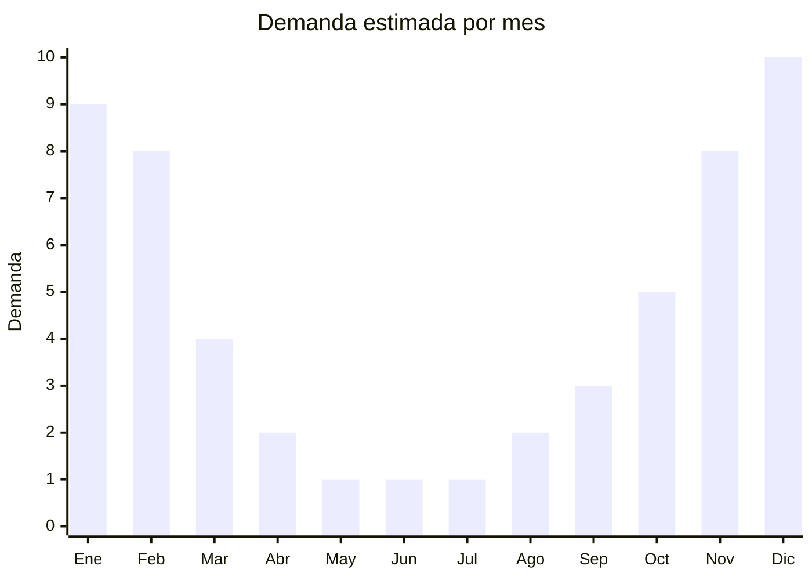

# Reposeras plegables de aluminio

> **Capitulo NCM 94** — Muebles, iluminacion y construcciones prefabricadas | **Temporada:** Verano (Dic--Feb)

## Que es y por que importarlo

Las reposeras plegables son sillas reclinables de estructura de aluminio (o acero) con tela de textilene (malla de PVC+poliester) disenadas para uso exterior: jardin, pileta, playa y terrazas. Ofrecen multiples posiciones de reclinado (tipicamente 5) y se pliegan para almacenamiento compacto. En Argentina, donde el verano impulsa la vida al aire libre, la demanda de reposeras se concentra fuertemente entre noviembre y febrero.

China es el principal proveedor mundial de mobiliario plegable de aluminio, con fabricas en Zhejiang (Anji, Yongkang) y Guangdong. Los precios FOB son muy competitivos frente a la produccion local. Las marcas de referencia en el mercado argentino incluyen Mor (Brasil), que domina el segmento medio, pero las opciones chinas sin marca o con marca propia permiten margenes atractivos.

El desafio critico de este producto es el volumen. Una reposera plegada puede ocupar entre 0.15 y 0.25 CBM, lo que significa que un contenedor de 20 pies (28 CBM) solo transporta aproximadamente 100-120 unidades. El flete puede representar entre el 30% y el 50% del costo total del producto importado. Por eso es fundamental seleccionar modelos que se plieguen lo mas compactos posible y negociar con el proveedor embalajes que minimicen el CBM.

<Warning>
**ALTO VOLUMEN = FLETE CARO.** Una reposera ocupa 0.15-0.25 CBM plegada. Un contenedor 20' (28 CBM) solo carga 100-120 unidades. El flete puede representar el 30-50% del costo total. Priorizar modelos ultra-plegables y evaluar siempre el costo por unidad incluyendo flete antes de cerrar la compra.
</Warning>

## Datos clave

| Dato | Valor |
|------|-------|
| **Posiciones NCM tipicas** | 9401.79.00 (asientos con armazon de metal), 9401.80.00 (otros asientos) |
| **Derecho de importacion** | 20% (DIE) + 3% tasa estadistica |
| **Rango FOB tipico** | USD 10.00 — USD 25.00 por unidad |
| **Precio de venta en Argentina** | ARS 30,000 — ARS 80,000 |
| **Margen bruto estimado** | 80% — 180% |
| **MOQ tipico** | 100 — 300 unidades |
| **Demanda en MercadoLibre** | Alta (estacional) |
| **Competencia en MercadoLibre** | Media-Alta (Mor domina) |
| **Dificultad para importar** | Media-Alta (volumen y flete) |
| **Certificaciones necesarias** | No requiere certificaciones especiales |
| **Antidumping** | No |

## Variantes y subtipos mas comunes

| Subtipo / Variante | FOB aprox. | Venta AR aprox. | Nota |
|--------------------|-----------|-----------------|------|
| Reposera basica 3 posiciones | USD 10.00 — 14.00 | ARS 30,000 — 45,000 | Economica, aluminio fino |
| Reposera 5 posiciones textilene | USD 14.00 — 20.00 | ARS 45,000 — 65,000 | **Mas vendida**, equilibrio precio/calidad |
| Reposera con parasol | USD 18.00 — 25.00 | ARS 55,000 — 80,000 | Parasol integrado, diferenciacion |
| Reposera con apoyabrazos acolchado | USD 16.00 — 22.00 | ARS 50,000 — 70,000 | Comfort premium |
| Reposera de playa baja plegable | USD 8.00 — 15.00 | ARS 25,000 — 50,000 | Mas compacta, mejor CBM |

## Regulaciones y requisitos

<Tabs>
  <Tab title="Certificaciones">
    | Organismo | Requiere | Detalle |
    |-----------|----------|---------|
    | ARCA (Aduana) | Si siempre | Despacho estandar |
    | INTI | No obligatorio | No hay norma IRAM obligatoria para reposeras |
    | ENACOM | No | No es producto electronico |
    | SENASA | No | No aplica |

    **Recomendacion:** Solicitar al proveedor certificado de prueba de carga (minimo 120 kg) y resistencia UV del textilene (minimo 1000 horas). El textilene de baja calidad se decolora y deforma en una temporada, generando reclamos de garantia.
  </Tab>

  <Tab title="Etiquetado">
    | Requisito | Aplica |
    |-----------|--------|
    | Idioma espanol | Si |
    | Datos del importador | Si |
    | Materiales (aluminio, textilene, acero) | Si |
    | Peso maximo soportado | Recomendado |
    | Pais de origen | Si |
    | Garantia legal 6 meses | Si |
    | Instrucciones de uso/plegado | Recomendado |
  </Tab>

  <Tab title="Restricciones">
    Sin restricciones especiales de importacion. No hay antidumping ni licencias previas para muebles plegables de aluminio.

    **Atencion:** Verificar que la estructura de aluminio tenga espesor minimo de 1.0 mm en los tubos principales. Los modelos ultra-baratos usan aluminio de 0.7-0.8 mm que se deforma con el uso y representa un riesgo de seguridad. Los remaches y articulaciones de plegado son el punto mas critico.
  </Tab>
</Tabs>

## Logistica

| Dato | Valor |
|------|-------|
| **Peso tipico por unidad** | 3.5 — 6.0 kg |
| **Volumen tipico** | 0.15 — 0.25 CBM por unidad (plegada) |
| **Fragilidad** | Baja (aluminio resistente) |
| **Envio recomendado** | Maritimo FCL (por volumen) |
| **Tiempo total estimado** | 60 — 90 dias (maritimo) |
| **Baterias de litio** | No |
| **Requiere empaque especial** | Si: proteccion en articulaciones y esquinas |

<Tip>
Buscar modelos que se plieguen en formato "plano" (flat-fold) en lugar de los que quedan con volumen residual. Los modelos flat-fold pueden reducir el CBM un 30-40%. Tambien negociar con el proveedor para que empaqueten 2 o 3 unidades por caja, eliminando espacio muerto entre cajas. Un contenedor 40HC (67 CBM) puede cargar 270-350 reposeras flat-fold vs. 180-220 de modelos convencionales.
</Tip>

## Estacionalidad



| Aspecto | Detalle |
|---------|---------|
| **Meses pico** | Noviembre-Febrero (verano, vacaciones, pileta, playa) |
| **Meses valle** | Mayo-Agosto (sin uso exterior) |
| **Cuando pedir** | Julio-Agosto para tener stock listo en noviembre |

## Ventajas y riesgos

<CardGroup cols={2}>
  <Card title="Ventajas" icon="circle-check">
    - Demanda masiva y predecible en verano
    - Producto de compra aspiracional (mejorar el jardin/terraza)
    - Sin barreras regulatorias complejas
    - Posibilidad de marca propia con logo en tela
    - Ticket medio-alto permite buenos margenes
  </Card>
  <Card title="Riesgos" icon="triangle-exclamation">
    - **Flete puede ser 30-50% del costo total** por alto CBM
    - Fuertemente estacional: stock sobrante queda hasta el proximo verano
    - Competencia de Mor (Brasil) con logistica mas corta
    - Textilene de mala calidad se decolora rapidamente
    - Articulaciones defectuosas generan riesgo de rotura y reclamos
    - Requiere inversion inicial alta por volumen minimo
  </Card>
</CardGroup>

## Palabras clave para buscar en Alibaba

```
folding sun lounger aluminum, outdoor recliner chair textilene,
beach lounger foldable wholesale, garden sun bed aluminum frame,
5 position reclining chair outdoor, pool lounger folding compact,
zero gravity chair wholesale, portable folding beach chair aluminum
```

## Fuentes

- [MercadoLibre Argentina — Reposeras plegables](https://listado.mercadolibre.com.ar/reposera-plegable)
- [Alibaba — Folding sun lounger wholesale](https://www.alibaba.com/trade/search?SearchText=folding+sun+lounger+aluminum)
- [Nomenclador NCM - ARCA (ex-AFIP)](https://www.arca.gob.ar)
