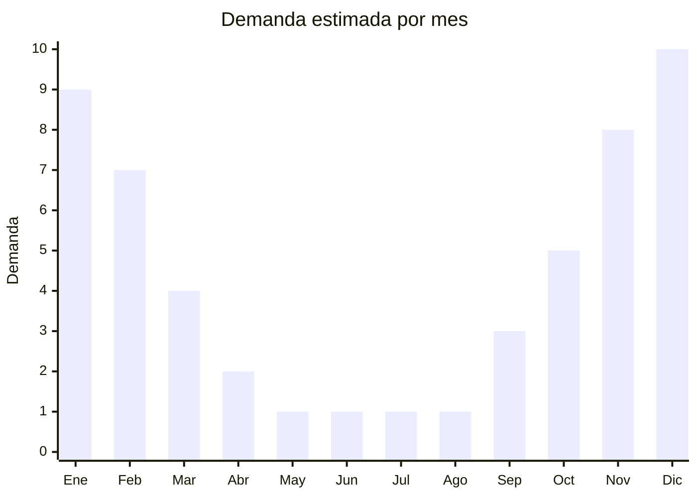

# Sombrillas de jardin y bases

> **Capitulo NCM 94** — Muebles, iluminacion y construcciones prefabricadas | **Temporada:** Verano (Dic--Feb)

## Que es y por que importarlo

Las sombrillas de jardin son parasoles grandes (tipicamente 2.5 a 3 metros de diametro) montados sobre un poste central de aluminio o acero, con mecanismo de apertura por manivela y sistema de inclinacion. Incluyen la base o pie (de plastico rellenable con agua/arena, cemento o metal) que proporciona estabilidad. Son el complemento esencial de cualquier espacio exterior: jardines, terrazas, patios con pileta, restaurantes con mesas al aire libre y balcones amplios.

En Argentina, la demanda se concentra entre octubre y febrero, con pico en diciembre-enero cuando se arman los espacios exteriores para las fiestas y el verano. China produce la gran mayoria de sombrillas de jardin del mundo, con centros en Zhejiang (Shaoxing para telas, Yongkang para estructuras metalicas) y Fujian.

El desafio principal es logistico: las sombrillas de jardin de 2.5-3 metros tienen un largo que puede requerir flete especial o embalaje diagonal en contenedor. Las bases de cemento o metal agregan peso significativo. Por eso, muchos importadores optan por importar solo la sombrilla y sourcing la base localmente, o seleccionan modelos con bases plasticas rellenables que pesan poco vacias.

<Warning>
**LARGO DE PIEZAS = FLETE ESPECIAL.** Las sombrillas de jardin de mas de 2 metros de largo no caben en palets estandar y pueden requerir embalaje diagonal o especial en contenedor. Evaluar modelos de poste desmontable (2 piezas) que reducen el largo a menos de 1.5 m. Las sombrillas de playa portatiles (mas pequenas) se clasifican en el Capitulo 66, no aqui.
</Warning>

## Datos clave

| Dato | Valor |
|------|-------|
| **Posiciones NCM tipicas** | 9406.90.00 (construcciones prefabricadas) o segun material: puede clasificar en 6601 si es portatil tipo paraguas |
| **Derecho de importacion** | 20% (DIE) + 3% tasa estadistica |
| **Rango FOB tipico** | USD 15.00 — USD 40.00 por unidad (sombrilla 2.5-3m con base basica) |
| **Precio de venta en Argentina** | ARS 40,000 — ARS 120,000 |
| **Margen bruto estimado** | 80% — 180% |
| **MOQ tipico** | 100 — 500 unidades |
| **Demanda en MercadoLibre** | Alta (estacional) |
| **Competencia en MercadoLibre** | Media |
| **Dificultad para importar** | Media-Alta (logistica por largo) |
| **Certificaciones necesarias** | No requiere certificaciones especiales |
| **Antidumping** | No |

## Variantes y subtipos mas comunes

| Subtipo / Variante | FOB aprox. | Venta AR aprox. | Nota |
|--------------------|-----------|-----------------|------|
| Sombrilla central 2.5m basica | USD 15.00 — 22.00 | ARS 40,000 — 65,000 | Poste recto, manivela |
| Sombrilla central 3m con inclinacion | USD 22.00 — 32.00 | ARS 65,000 — 90,000 | **Mas vendida**, inclinacion + manivela |
| Sombrilla lateral (banana) 3m | USD 30.00 — 45.00 | ARS 80,000 — 130,000 | Poste lateral, premium, mayor CBM |
| Base plastica rellenable | USD 3.00 — 6.00 | ARS 10,000 — 25,000 | Liviana vacia, ideal para importar |
| Base de metal/cemento | USD 8.00 — 15.00 | ARS 20,000 — 40,000 | Pesada, evaluar sourcing local |

<Note>
Las sombrillas de playa portatiles (tipo paraguas, diametro 1.5-2m, con punta para clavar en arena) se clasifican en el **Capitulo 66** (paraguas y sombrillas), no en el Capitulo 94. Esta pagina cubre exclusivamente sombrillas de jardin fijas con base.
</Note>

## Regulaciones y requisitos

<Tabs>
  <Tab title="Certificaciones">
    | Organismo | Requiere | Detalle |
    |-----------|----------|---------|
    | ARCA (Aduana) | Si siempre | Despacho estandar |
    | INTI | No obligatorio | No hay norma IRAM obligatoria para sombrillas de jardin |
    | ENACOM | No | No es producto electronico |
    | SENASA | No | No aplica |

    **Recomendacion:** Solicitar al proveedor certificado de resistencia UV de la tela (minimo UPF 30, idealmente UPF 50+) y test de resistencia al viento. La tela de poliester de baja calidad se decolora en una temporada y no protege efectivamente del sol.
  </Tab>

  <Tab title="Etiquetado">
    | Requisito | Aplica |
    |-----------|--------|
    | Idioma espanol | Si |
    | Datos del importador | Si |
    | Materiales (estructura y tela) | Si |
    | Diametro/medidas | Si |
    | Proteccion UV (UPF) | Recomendado |
    | Pais de origen | Si |
    | Garantia legal 6 meses | Si |
    | Instrucciones de armado | Si |
  </Tab>

  <Tab title="Restricciones">
    Sin restricciones especiales de importacion. No hay antidumping ni licencias previas.

    **Atencion al clasificar:** La posicion arancelaria puede variar segun si la sombrilla se considera "mueble de jardin" (Cap. 94) o "paraguas/sombrilla" (Cap. 66). Las sombrillas de jardin con base fija generalmente clasifican en Cap. 94. Consultar con un despachante antes de importar para confirmar la posicion exacta.
  </Tab>
</Tabs>

## Logistica

| Dato | Valor |
|------|-------|
| **Peso tipico por unidad** | 5.0 — 12.0 kg (sombrilla + base plastica) |
| **Volumen tipico** | 0.10 — 0.30 CBM por unidad (segun modelo) |
| **Fragilidad** | Media (mecanismo de manivela delicado) |
| **Envio recomendado** | Maritimo FCL o LCL segun volumen |
| **Tiempo total estimado** | 60 — 90 dias (maritimo) |
| **Baterias de litio** | No |
| **Requiere empaque especial** | Si: proteccion del mecanismo y tela |

<Tip>
Seleccionar sombrillas con **poste desmontable en 2 piezas** reduce el largo del paquete de 2.5m a 1.3m, facilitando enormemente el embalaje en contenedor estandar. Importar las bases de plastico rellenable **vacias** (pesan solo 1-2 kg) y no bases de cemento o metal que agregan peso innecesario al flete. Si el volumen no justifica FCL, las sombrillas con poste corto pueden ir en LCL sin problema.
</Tip>

## Estacionalidad



| Aspecto | Detalle |
|---------|---------|
| **Meses pico** | Noviembre-Enero (armado de espacios exteriores, fiestas, verano pleno) |
| **Meses valle** | Mayo-Agosto (sin uso exterior) |
| **Cuando pedir** | Julio-Agosto para tener stock listo en octubre-noviembre |

## Ventajas y riesgos

<CardGroup cols={2}>
  <Card title="Ventajas" icon="circle-check">
    - Alta demanda en verano, producto visible y deseado
    - Ticket medio-alto con buenos margenes
    - Complemento natural con mesas y sillas de jardin (venta cruzada)
    - Variedad de colores y estilos para diferenciar
    - Sin barreras regulatorias
  </Card>
  <Card title="Riesgos" icon="triangle-exclamation">
    - Largo de piezas complica logistica y flete
    - Fuertemente estacional: stock sobrante queda hasta siguiente verano
    - Tela de baja calidad se decolora en una temporada (reclamos)
    - Mecanismo de manivela es punto de falla comun
    - Bases pesadas encarecen flete si no se eligen plasticas
    - Clasificacion arancelaria puede ser ambigua (Cap. 94 vs Cap. 66)
  </Card>
</CardGroup>

## Palabras clave para buscar en Alibaba

```
garden umbrella wholesale, patio umbrella with crank tilt,
outdoor parasol 3m aluminum, cantilever umbrella banana,
garden umbrella base plastic, sun umbrella patio wholesale,
market umbrella 2.5m crank, beach patio umbrella factory
```

## Fuentes

- [MercadoLibre Argentina — Sombrillas de jardin](https://listado.mercadolibre.com.ar/sombrilla-jardin)
- [Alibaba — Garden umbrella wholesale](https://www.alibaba.com/trade/search?SearchText=garden+umbrella+wholesale)
- [Nomenclador NCM - ARCA (ex-AFIP)](https://www.arca.gob.ar)
