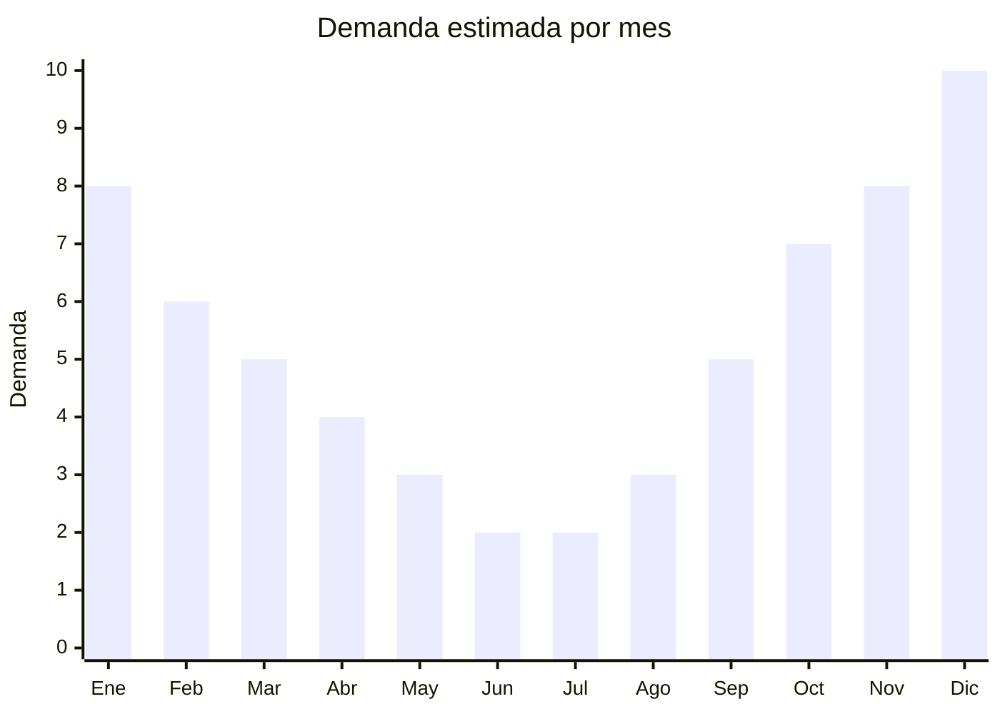

# Bicicletas rodado 20-29 y accesorios

> **Capítulo NCM 95** — Juguetes, juegos y artículos para recreo o deporte | **Temporada:** Verano (Dic–Feb)

## Qué es y por qué importarlo

Las bicicletas son uno de los productos de mayor volumen de importación desde China en el rubro deportivo/recreativo. China produce más del 60% de las bicicletas del mundo, con clústeres industriales masivos en Tianjin, Guangdong y Zhejiang. Desde bicicletas urbanas económicas hasta mountain bikes de gama media, las fábricas chinas producen para marcas globales y para el mercado de marca blanca.

En Argentina, la demanda de bicicletas tiene un pico marcado en primavera-verano (septiembre-febrero) potenciado por el clima cálido para andar al aire libre, y otro pico en diciembre por ser un regalo navideño estrella. Las marcas chinas con presencia local (Raleigh, TopMega, Venzo, Firebird, SLP) dominan el segmento económico y medio, importando directamente de fábricas OEM chinas.

El principal desafío de importar bicicletas es logístico: son productos de alto volumen y peso. Una bicicleta rodado 29 empacada ocupa aproximadamente 0.15-0.20 CBM y pesa 15-18 kg. Un contenedor de 20 pies cabe entre 100-150 bicicletas. El flete por unidad es significativo y debe calcularse cuidadosamente para mantener márgenes. Los accesorios (cascos, luces, candados, infladores, portaequipajes) son complementos con mejor ratio volumen/margen.

## Datos clave

| Dato | Valor |
|------|-------|
| **Posiciones NCM típicas** | 8712.00.10 (bicicletas sin motor), 9506.99.00 (accesorios deportivos) |
| **Derecho de importación** | 20% (DIE) + 3% tasa estadística |
| **Rango FOB típico** | USD 40.00 — USD 120.00 por bicicleta |
| **Precio de venta en Argentina** | ARS 100.000 — ARS 400.000 |
| **Margen bruto estimado** | 80% — 150% |
| **MOQ típico** | 50 — 200 unidades (un contenedor) |
| **Demanda en MercadoLibre** | Muy Alta (todo el año, pico verano) |
| **Competencia en MercadoLibre** | Muy Alta |
| **Dificultad para importar** | Alta (volumen, peso, logística, servicio técnico) |
| **Certificaciones necesarias** | No requiere IRAM 3583 (no es juguete para menores de 14) |
| **Antidumping** | Verificar vigencia (ha habido medidas contra bicicletas chinas) |

## Variantes y subtipos más comunes

| Subtipo / Variante | FOB aprox. | Venta AR aprox. | Nota |
|--------------------|-----------|-----------------|------|
| Bicicleta urbana rodado 26 | USD 40.00 — 60.00 | ARS 100.000 — 180.000 | Económica, uso diario |
| Mountain bike rodado 29 | USD 60.00 — 90.00 | ARS 180.000 — 300.000 | **Más vendida** |
| Bicicleta paseo rodado 26 mujer | USD 45.00 — 65.00 | ARS 120.000 — 200.000 | Canasto, guardabarros |
| Bicicleta rodado 20 niño/adolescente | USD 35.00 — 55.00 | ARS 80.000 — 150.000 | Regalo Navidad estrella |
| Bicicleta plegable rodado 20 | USD 50.00 — 80.00 | ARS 150.000 — 250.000 | Urbana, departamentos |
| Bicicleta fixie/single speed | USD 45.00 — 70.00 | ARS 120.000 — 220.000 | Tendencia urbana joven |
| Accesorios (cascos, luces, candados) | USD 2.00 — 15.00 | ARS 8.000 — 50.000 | Complemento alto margen |

## Regulaciones y requisitos

<Tabs>
  <Tab title="Certificaciones">
    | Organismo | Requiere | Detalle |
    |-----------|----------|---------|
    | ARCA (Aduana) | Sí siempre | Despacho estándar |
    | IRAM 3583 | No | Las bicicletas rodado 20+ no son juguetes para menores de 14 años |
    | ANMAT | No | No aplica |
    | ENACOM | No | No es electrónico (bicicletas sin motor) |
    | SENASA | No | No aplica |

    **Nota:** Las bicicletas rodado 20 y superiores son equipamiento deportivo/recreativo, no juguetes. No requieren certificación IRAM 3583. Las bicicletas con rodado 12-16 para niños pequeños sí podrían clasificar como juguete y requerir IRAM. Verificar si existen medidas antidumping vigentes contra bicicletas chinas antes de importar.
  </Tab>

  <Tab title="Etiquetado">
    | Requisito | Aplica |
    |-----------|--------|
    | Idioma español | Sí |
    | Datos del importador | Sí |
    | Número de serie/cuadro | Sí |
    | Especificaciones técnicas | Sí (rodado, cambios, frenos, material cuadro) |
    | País de origen | Sí |
    | Garantía legal 6 meses | Sí |
    | Manual de armado y uso | Sí |
    | Peso máximo de usuario | Recomendado |
  </Tab>

  <Tab title="Restricciones">
    Verificar vigencia de medidas antidumping contra bicicletas de origen chino. Históricamente ha habido derechos antidumping sobre bicicletas chinas en Argentina. Consultar con un despachante de aduanas actualizado antes de importar.

    **Atención:** Las bicicletas eléctricas (e-bikes) clasifican diferente y requieren intervención de ENACOM por sus componentes electrónicos y baterías de litio. Este artículo cubre solo bicicletas mecánicas sin motor.
  </Tab>
</Tabs>

## Logística

| Dato | Valor |
|------|-------|
| **Peso típico por unidad** | 12 — 18 kg |
| **Volumen típico** | Alto (0.15 — 0.20 CBM por bicicleta empacada) |
| **Fragilidad** | Media (rayones, deformaciones si se golpean) |
| **Envío recomendado** | Marítimo FCL (contenedor completo) |
| **Tiempo total estimado** | 50 — 80 días (marítimo) |
| **Baterías de litio** | No (bicicletas mecánicas) |
| **Requiere empaque especial** | Sí (caja individual con protecciones de espuma) |

<Tip>
Las bicicletas se envían **semi-armadas** (SKD - Semi Knocked Down) para optimizar espacio: cuadro con rueda trasera montada, rueda delantera suelta, manubrio girado 90°, pedales sueltos. Esto reduce el CBM por unidad un 30-40% respecto a envío armado. Considerar tener un mecánico/armador para ensamblar antes de la venta. Un contenedor 40' HC puede transportar 250-350 bicicletas según rodado.
</Tip>

## Estacionalidad



| Aspecto | Detalle |
|---------|---------|
| **Meses pico** | Octubre-Enero (primavera-verano + Navidad) |
| **Meses valle** | Junio-Agosto (invierno, menos uso outdoor) |
| **Cuándo pedir** | Junio-Julio para tener stock en octubre |

## Ventajas y riesgos

<CardGroup cols={2}>
  <Card title="Ventajas" icon="circle-check">
    - Demanda masiva y sostenida todo el año (pico en verano)
    - Ticket alto = márgenes absolutos importantes
    - No requiere IRAM ni certificaciones complejas (rodado 20+)
    - Las mismas fábricas producen para marcas reconocidas
    - Venta cruzada con accesorios de alto margen
    - Producto aspiracional con demanda creciente
  </Card>
  <Card title="Riesgos" icon="triangle-exclamation">
    - Alto volumen y peso = flete costoso, logística compleja
    - Posibles medidas antidumping vigentes (verificar)
    - Competencia feroz con marcas establecidas
    - Requiere servicio post-venta y repuestos
    - Necesita espacio de almacenamiento considerable
    - Armado final requiere personal técnico calificado
  </Card>
</CardGroup>

## Palabras clave para buscar en Alibaba

```
mountain bike 29 wholesale, bicycle 26 inch wholesale, city bike urban wholesale,
folding bike 20 inch, bicycle factory OEM China, bike accessories wholesale,
MTB 29er aluminum frame, bicycle SKD CKD wholesale
```

## Fuentes

- [MercadoLibre Argentina — Bicicletas](https://listado.mercadolibre.com.ar/bicicletas)
- [Alibaba — Bicycle wholesale](https://www.alibaba.com/showroom/bicycle.html)
