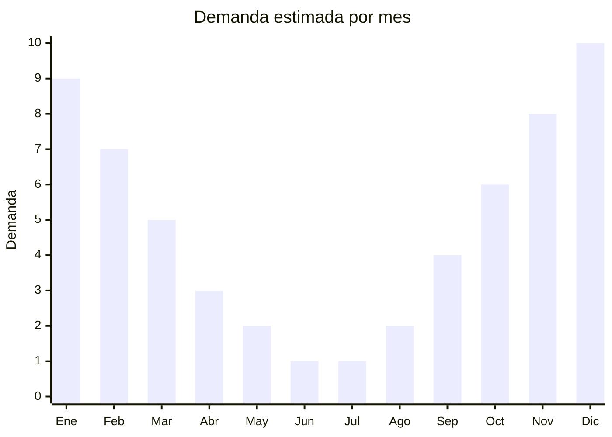

# Bolsas de dormir para verano

> **Capítulo NCM 95** — Juguetes, juegos y artículos para recreo o deporte | **Temporada:** Verano (Dic–Feb)

## Qué es y por qué importarlo

Las bolsas de dormir para verano son sacos aislantes de temperatura confort entre 0°C y 15°C, diseñados para acampar durante los meses cálidos cuando las noches son templadas. Se las denomina también "bolsas 3 estaciones" porque sirven para primavera, verano y otoño. Son más livianas y compactas que las bolsas de invierno, lo que las hace ideales para camping recreativo, festivales, viajes mochileros y escapadas de fin de semana.

China produce la gran mayoría de bolsas de dormir económicas y de rango medio del mercado mundial, con fábricas concentradas en Zhejiang (Ningbo, Hangzhou) y Jiangsu. Los rellenos van desde fibra hueca de poliéster (hollow fiber) para modelos económicos hasta plumón sintético y plumón natural de pato/ganso para modelos premium. Las marcas argentinas populares (Waterdog, NatGeo, Doite, Hummer) fabrican sus bolsas en estas mismas fábricas chinas.

La ventaja logística es que las bolsas de dormir comprimidas en su bolsa de transporte ocupan poco volumen relativo a su precio de venta. El pico de demanda coincide con la temporada de camping (noviembre-marzo) y el regalo navideño para campistas.

## Datos clave

| Dato | Valor |
|------|-------|
| **Posiciones NCM típicas** | 9506.29.00 (artículos para deportes y actividades al aire libre) |
| **Derecho de importación** | 20% (DIE) + 3% tasa estadística |
| **Rango FOB típico** | USD 5.00 — USD 20.00 por unidad |
| **Precio de venta en Argentina** | ARS 20.000 — ARS 80.000 |
| **Margen bruto estimado** | 100% — 200% |
| **MOQ típico** | 100 — 500 unidades |
| **Demanda en MercadoLibre** | Alta (estacional con base anual) |
| **Competencia en MercadoLibre** | Media |
| **Dificultad para importar** | Fácil-Media |
| **Certificaciones necesarias** | No requiere IRAM 3583 (no es juguete) |
| **Antidumping** | No |

## Variantes y subtipos más comunes

| Subtipo / Variante | FOB aprox. | Venta AR aprox. | Nota |
|--------------------|-----------|-----------------|------|
| Bolsa rectangular básica (10-15°C) | USD 5.00 — 8.00 | ARS 20.000 — 35.000 | Económica, camping casual |
| Bolsa momia liviana (5-10°C) | USD 8.00 — 12.00 | ARS 30.000 — 50.000 | **Más vendida** |
| Bolsa 3 estaciones (0-10°C) | USD 10.00 — 15.00 | ARS 40.000 — 60.000 | Versátil, primavera a otoño |
| Bolsa doble (2 personas) | USD 12.00 — 20.00 | ARS 45.000 — 80.000 | Parejas, camping romántico |
| Bolsa infantil con diseño | USD 5.00 — 10.00 | ARS 18.000 — 35.000 | Niños, pijamadas, scouts |
| Liner/sábana para bolsa | USD 2.00 — 5.00 | ARS 8.000 — 20.000 | Accesorio complementario |

## Regulaciones y requisitos

<Tabs>
  <Tab title="Certificaciones">
    | Organismo | Requiere | Detalle |
    |-----------|----------|---------|
    | ARCA (Aduana) | Sí siempre | Despacho estándar |
    | IRAM 3583 | No | No es juguete, es equipamiento deportivo/recreativo |
    | ANMAT | No | No aplica |
    | ENACOM | No | No es electrónico |
    | SENASA | No | No aplica (verificar si tiene relleno de plumón natural) |

    **Nota:** Las bolsas de dormir son equipamiento deportivo/recreativo, no juguetes. No requieren certificación IRAM 3583 incluso las versiones infantiles, siempre que se comercialicen como equipamiento de camping y no como juguete. Los certificados de temperatura del proveedor (EN 13537 europeo) agregan credibilidad.
  </Tab>

  <Tab title="Etiquetado">
    | Requisito | Aplica |
    |-----------|--------|
    | Idioma español | Sí |
    | Datos del importador | Sí |
    | Composición / materiales | Sí (tipo de relleno, tela exterior e interior) |
    | Rango de temperatura | Sí (confort, límite, extrema) |
    | Dimensiones (largo x ancho) | Sí |
    | Peso total y peso del relleno | Recomendado |
    | País de origen | Sí |
    | Garantía legal 6 meses | Sí |
    | Instrucciones de lavado | Sí |
  </Tab>

  <Tab title="Restricciones">
    Sin restricciones especiales. No hay antidumping, licencias previas ni certificaciones obligatorias.

    **Atención:** Si la bolsa tiene relleno de plumón natural de pato o ganso, puede requerir certificado fitosanitario o SENASA dependiendo del origen. Las bolsas con relleno sintético (hollow fiber, microfibra) no tienen esta restricción. Verificar que los tintes de la tela no contengan sustancias azo (cumplimiento Oeko-Tex es un plus).
  </Tab>
</Tabs>

## Logística

| Dato | Valor |
|------|-------|
| **Peso típico por unidad** | 0.8 — 2.5 kg |
| **Volumen típico** | Bajo-Medio (comprimidas en bolsa de transporte) |
| **Fragilidad** | Muy Baja (textil, no se rompe) |
| **Envío recomendado** | Marítimo LCL o consolidado |
| **Tiempo total estimado** | 50 — 80 días (marítimo) |
| **Baterías de litio** | No |
| **Requiere empaque especial** | No |

<Tip>
Las bolsas de dormir se **comprimen significativamente** con bolsas de compresión. Pedir al proveedor que envíe cada unidad ya comprimida al máximo en su bolsa de transporte reduce el CBM hasta un 60% respecto al empaque suelto. Verificar que incluyan correas de compresión externas. Combinar con carpas de camping en el mismo envío para ofrecer un "kit campista" completo.
</Tip>

## Estacionalidad



| Aspecto | Detalle |
|---------|---------|
| **Meses pico** | Noviembre-Febrero (camping de verano, vacaciones, Navidad regalo) |
| **Meses valle** | Junio-Agosto (invierno, se usan bolsas más térmicas) |
| **Cuándo pedir** | Julio-Agosto para tener stock en octubre |

## Ventajas y riesgos

<CardGroup cols={2}>
  <Card title="Ventajas" icon="circle-check">
    - No requiere certificaciones obligatorias
    - Comprimidas ocupan poco volumen = flete eficiente
    - Demanda sostenida (camping, scouts, viajes)
    - Producto no perecedero, stock se conserva bien
    - Mercado de camping en crecimiento post-pandemia
    - Complemento natural de carpas (venta cruzada)
  </Card>
  <Card title="Riesgos" icon="triangle-exclamation">
    - Competencia con marcas establecidas (Waterdog, NatGeo, Doite)
    - Calidad del relleno difícil de verificar sin laboratorio
    - Ratings de temperatura chinos suelen ser optimistas (verificar)
    - Cierres/zippers de baja calidad = principal falla
    - Bolsas con plumón natural pueden tener olor si no están bien tratadas
  </Card>
</CardGroup>

## Palabras clave para buscar en Alibaba

```
sleeping bag summer wholesale, sleeping bag 3 season, sleeping bag lightweight camping,
mummy sleeping bag hollow fiber, rectangular sleeping bag camping, double sleeping bag,
sleeping bag compression sack, kids sleeping bag camping wholesale
```

## Fuentes

- [MercadoLibre Argentina — Bolsas de dormir](https://listado.mercadolibre.com.ar/bolsa-de-dormir)
- [Alibaba — Sleeping bag wholesale](https://www.alibaba.com/showroom/sleeping-bag.html)
