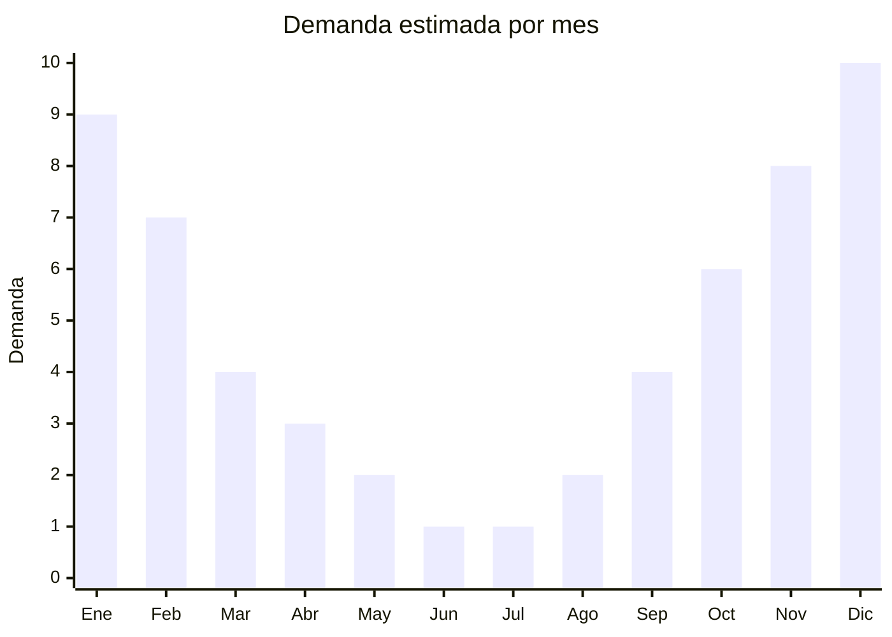

# Carpas de camping y playa

> **Capítulo NCM 95** — Juguetes, juegos y artículos para recreo o deporte | **Temporada:** Verano (Dic–Feb)

## Qué es y por qué importarlo

Las carpas de camping y playa son estructuras portátiles de tela técnica con armazón de fibra de vidrio o aluminio, diseñadas para proteger del sol, viento y lluvia durante actividades al aire libre. Incluyen desde carpas igloo clásicas de 2-4 personas para camping hasta carpas de playa tipo pop-up (autoarmables) que se abren en segundos y ofrecen sombra y protección UV.

China es el principal productor mundial de carpas recreativas, con clústeres de fábricas en Zhejiang (Ningbo, Yiwu) y Fujian especializados en outdoor gear. Marcas argentinas populares como Waterdog, NatGeo (licencia National Geographic), Hummer y otras diseñan en Argentina pero fabrican en China. Importar directamente de las mismas fábricas OEM permite acceder a productos de calidad similar a precios FOB muy competitivos.

El pico de demanda se concentra en primavera-verano (octubre-febrero) con las vacaciones, los fines de semana en la costa y la temporada de camping. Las carpas de playa autoarmables son especialmente populares entre familias con niños que buscan sombra rápida y práctica.

## Datos clave

| Dato | Valor |
|------|-------|
| **Posiciones NCM típicas** | 9506.29.00 (artículos para deportes y actividades al aire libre) |
| **Derecho de importación** | 20% (DIE) + 3% tasa estadística |
| **Rango FOB típico** | USD 10.00 — USD 40.00 por unidad |
| **Precio de venta en Argentina** | ARS 30.000 — ARS 120.000 |
| **Margen bruto estimado** | 100% — 200% |
| **MOQ típico** | 100 — 500 unidades |
| **Demanda en MercadoLibre** | Alta (estacional con base anual) |
| **Competencia en MercadoLibre** | Media-Alta |
| **Dificultad para importar** | Media (alto volumen empacadas) |
| **Certificaciones necesarias** | No requiere IRAM 3583 (no es juguete) |
| **Antidumping** | No |

## Variantes y subtipos más comunes

| Subtipo / Variante | FOB aprox. | Venta AR aprox. | Nota |
|--------------------|-----------|-----------------|------|
| Carpa playa pop-up 2 personas | USD 10.00 — 15.00 | ARS 30.000 — 50.000 | **Más vendida**, autoarmable |
| Carpa igloo 2 personas | USD 12.00 — 18.00 | ARS 35.000 — 60.000 | Camping económico |
| Carpa igloo 4 personas | USD 18.00 — 28.00 | ARS 55.000 — 90.000 | Camping familiar |
| Carpa igloo 6 personas | USD 25.00 — 40.00 | ARS 80.000 — 120.000 | Grupos, scouts |
| Carpa playa con protección UV | USD 12.00 — 20.00 | ARS 35.000 — 65.000 | UPF 50+, familias con niños |
| Gazebo/techo plegable 3x3m | USD 20.00 — 35.00 | ARS 60.000 — 100.000 | Eventos, ferias, playa |

## Regulaciones y requisitos

<Tabs>
  <Tab title="Certificaciones">
    | Organismo | Requiere | Detalle |
    |-----------|----------|---------|
    | ARCA (Aduana) | Sí siempre | Despacho estándar |
    | IRAM 3583 | No | No es juguete, es equipamiento deportivo/recreativo para adultos |
    | ANMAT | No | No aplica |
    | ENACOM | No | No es electrónico |
    | SENASA | No | No aplica |

    **Nota:** Las carpas de camping y playa son equipamiento deportivo/recreativo, no juguetes. No requieren certificación IRAM 3583. Tampoco requieren certificaciones técnicas obligatorias, aunque contar con certificados de resistencia al agua (columna de agua en mm) y protección UV (UPF) del proveedor agrega valor comercial.
  </Tab>

  <Tab title="Etiquetado">
    | Requisito | Aplica |
    |-----------|--------|
    | Idioma español | Sí |
    | Datos del importador | Sí |
    | Composición / materiales | Sí (tipo de tela, estructura) |
    | Capacidad de personas | Sí |
    | Dimensiones armada y empacada | Sí |
    | Columna de agua (impermeabilidad) | Recomendado |
    | Factor UPF (protección solar) | Recomendado |
    | País de origen | Sí |
    | Garantía legal 6 meses | Sí |
    | Instrucciones de armado | Sí |
  </Tab>

  <Tab title="Restricciones">
    Sin restricciones especiales de importación. No hay antidumping, licencias previas ni certificaciones obligatorias.

    **Atención:** Verificar que la tela tenga tratamiento ignífugo (fire retardant). Si bien no es obligatorio en Argentina para carpas recreativas, es un diferencial de seguridad importante. Las varillas de fibra de vidrio deben ser de calidad adecuada para evitar que se quiebren con viento fuerte.
  </Tab>
</Tabs>

## Logística

| Dato | Valor |
|------|-------|
| **Peso típico por unidad** | 1.5 — 8.0 kg (según tamaño) |
| **Volumen típico** | Medio-Alto (bolsas cilíndricas largas) |
| **Fragilidad** | Baja-Media (varillas pueden quebrarse si se golpean) |
| **Envío recomendado** | Marítimo LCL o FCL según volumen |
| **Tiempo total estimado** | 50 — 80 días (marítimo) |
| **Baterías de litio** | No |
| **Requiere empaque especial** | Recomendado bolsa con cierre + caja master reforzada |

<Tip>
Las carpas empacadas tienen forma cilíndrica que no optimiza bien el espacio en contenedor. Negociar con el proveedor **empaque en caja rectangular** en lugar de bolsa cilíndrica permite apilar mejor y aprovechar hasta un 20% más de espacio. Para carpas pop-up de playa, verificar que el mecanismo de plegado funcione correctamente: probar una muestra antes del pedido masivo, ya que la queja más común es que son difíciles de replegar.
</Tip>

## Estacionalidad



| Aspecto | Detalle |
|---------|---------|
| **Meses pico** | Noviembre-Febrero (verano, vacaciones, camping) |
| **Meses valle** | Junio-Agosto (invierno, menor actividad outdoor) |
| **Cuándo pedir** | Julio-Agosto para tener stock en octubre (inicio temporada) |

## Ventajas y riesgos

<CardGroup cols={2}>
  <Card title="Ventajas" icon="circle-check">
    - No requiere IRAM ni certificaciones obligatorias
    - Demanda sostenida (camping + playa + eventos)
    - Ticket medio-alto, buenos márgenes absolutos
    - Las mismas fábricas producen para marcas premium
    - Mercado creciente: camping y outdoor en auge post-pandemia
    - Producto duradero pero con obsolescencia estética
  </Card>
  <Card title="Riesgos" icon="triangle-exclamation">
    - Alto volumen empacadas: flete costoso vs. peso
    - Competencia con marcas establecidas (Waterdog, NatGeo, Hummer)
    - Calidad de costuras y soldaduras variable entre proveedores
    - Varillas de fibra de vidrio baratas se quiebran fácil
    - Post-venta: si falla una varilla o cierre, difícil de reparar
    - Carpas pop-up: si el mecanismo falla, producto inservible
  </Card>
</CardGroup>

## Palabras clave para buscar en Alibaba

```
camping tent wholesale, pop up beach tent UV, igloo tent 4 person,
beach tent sun shelter UPF50, dome tent camping wholesale, pop up tent automatic,
gazebo folding tent 3x3, camping tent waterproof family
```

## Fuentes

- [MercadoLibre Argentina — Carpas de camping](https://listado.mercadolibre.com.ar/carpas-camping)
- [MercadoLibre Argentina — Carpas de playa](https://listado.mercadolibre.com.ar/carpa-playa)
- [Alibaba — Camping tent wholesale](https://www.alibaba.com/showroom/camping-tent.html)
