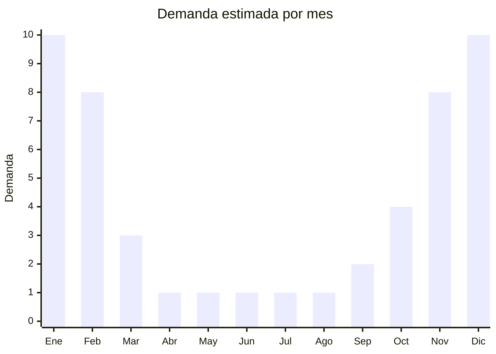

# Colchonetas inflables para pileta

> **Capítulo NCM 95** — Juguetes, juegos y artículos para recreo o deporte | **Temporada:** Verano (Dic–Feb)

## Qué es y por qué importarlo

Las colchonetas inflables para pileta y mar abarcan colchones flotantes individuales, islas flotantes para 2-4 personas, sillones inflables con respaldo y portavasos, hamacas flotantes de malla, y los icónicos inflables gigantes con forma de flamenco, unicornio, dona, pizza y otros diseños "instagrameables". Son productos 100% estacionales con demanda concentrada entre noviembre y febrero, impulsados por la cultura de pileta/playa y la viralización en redes sociales.

Bestway (Jilong) e Intex dominan el mercado mundial de inflables acuáticos, pero hay un enorme espacio para modelos de diseño (formas originales, colores tendencia, inflables XXL para fotos) que circulan viralmente en Instagram y TikTok. Los inflables gigantes con forma de animal (flamenco rosado, unicornio, cisne) o comida (dona, pizza, sandía) se convirtieron en un fenómeno global de redes sociales que impulsa ventas por compra aspiracional: el cliente compra la experiencia fotográfica tanto como el producto en sí.

China (Yiwu, Shantou) produce la inmensa mayoría de colchonetas e inflables del mundo, con precios FOB extremadamente competitivos (desde USD 1 por colchón básico) y posibilidad de personalización en formas y colores. Los márgenes en Argentina son atractivos, especialmente para los inflables de diseño que tienen menor competencia de precio.

## Datos clave

| Dato | Valor |
|------|-------|
| **Posiciones NCM típicas** | 9506.29.00 (artículos para deportes acuáticos/natación), 3926.90.90 (otras manufacturas plásticas) |
| **Derecho de importación** | 18-20% (DIE) + 3% tasa estadística |
| **Rango FOB típico** | USD 1.00 — USD 10.00 por unidad |
| **Precio de venta en Argentina** | ARS 5.000 — ARS 30.000 |
| **Margen bruto estimado** | 200% — 400% |
| **MOQ típico** | 100 — 500 unidades |
| **Demanda en MercadoLibre** | Muy Alta (100% estacional) |
| **Competencia en MercadoLibre** | Alta |
| **Dificultad para importar** | Fácil |
| **Certificaciones necesarias** | No requiere (no se comercializa como dispositivo de seguridad) |
| **Antidumping** | No |

## Variantes y subtipos más comunes

| Subtipo / Variante | FOB aprox. | Venta AR aprox. | Nota |
|--------------------|-----------|-----------------|------|
| Colchón inflable básico individual | USD 1.00 — 2.50 | ARS 5.000 — 10.000 | Alta rotación |
| Isla flotante 2-4 personas | USD 5.00 — 10.00 | ARS 15.000 — 30.000 | Premium, mayor ticket |
| Sillón inflable pileta con portavasos | USD 2.50 — 5.00 | ARS 8.000 — 18.000 | Popular adultos |
| Animal inflable gigante (flamenco/unicornio) | USD 3.00 — 8.00 | ARS 10.000 — 25.000 | **Más vendido** — tendencia redes |
| Hamaca inflable flotante con malla | USD 1.50 — 3.50 | ARS 5.000 — 12.000 | Relajación pileta |

## Regulaciones y requisitos

<Tabs>
  <Tab title="Certificaciones">
    | Organismo | Requiere | Detalle |
    |-----------|----------|---------|
    | ARCA (Aduana) | Sí siempre | Despacho estándar |
    | IRAM | No obligatorio | Si se comercializa como "flotador recreativo" sin función de seguridad |
    | ANMAT | No | No aplica |
    | ENACOM | No | No es electrónico |

    **Recomendación:** Comercializar siempre como "colchoneta inflable recreativa" o "flotador de entretenimiento", nunca como "salvavidas" ni "dispositivo de flotación de seguridad". Si se etiqueta como elemento de seguridad acuática, puede requerir certificación adicional de la Prefectura Naval.
  </Tab>

  <Tab title="Etiquetado">
    | Requisito | Aplica |
    |-----------|--------|
    | Idioma español | Sí |
    | Datos del importador | Sí |
    | Advertencia "No es salvavidas" | **Sí, fundamental** |
    | Advertencia "Usar bajo supervisión" | Sí (especialmente infantiles) |
    | Composición / materiales | Sí (PVC, vinilo) |
    | Dimensiones inflado | Sí |
    | País de origen | Sí |
    | Garantía legal 6 meses | Sí |
  </Tab>

  <Tab title="Restricciones">
    Sin restricciones de importación específicas. No hay antidumping ni licencias previas.

    **Atención:** No comercializar como "salvavidas" ni hacer referencia a seguridad acuática en la publicación. Usar términos como "colchoneta recreativa", "flotador de entretenimiento", "inflable para pileta". Incluir siempre la advertencia "Este producto no es un dispositivo de salvamento. No dejar niños sin supervisión adulta."
  </Tab>
</Tabs>

## Logística

| Dato | Valor |
|------|-------|
| **Peso típico por unidad** | 0.3 — 2.0 kg (desinflados) |
| **Volumen típico** | Bajo-Medio (desinflados y doblados ocupan poco) |
| **Fragilidad** | Baja (PVC flexible) |
| **Envío recomendado** | Marítimo LCL |
| **Tiempo total estimado** | 45 — 75 días (marítimo) |
| **Baterías de litio** | No |
| **Requiere empaque especial** | No |

<Tip>
Los inflables con forma (flamenco, unicornio, dona) se desinflados ocupan muy poco espacio. Esto permite enviar grandes cantidades en un LCL pequeño. Es una excelente relación volumen-desinflado vs. precio de venta inflado. Un pedido de 500 flamencos inflables puede caber en 2-3 CBM desinflados y empacados.
</Tip>

## Estacionalidad



| Aspecto | Detalle |
|---------|---------|
| **Meses pico** | Diciembre-Enero (regalos Navidad + uso pleno verano) |
| **Meses valle** | Abril-Septiembre (cero demanda, producto 100% estacional) |
| **Cuándo pedir** | Agosto-Septiembre para tener stock en noviembre-diciembre |

## Ventajas y riesgos

<CardGroup cols={2}>
  <Card title="Ventajas" icon="circle-check">
    - Márgenes altísimos (200-400%)
    - Producto liviano desinflado, flete económico
    - Sin regulación compleja
    - Tendencia redes sociales impulsa demanda
    - Compra impulsiva y emocional (diseños atractivos)
  </Card>
  <Card title="Riesgos" icon="triangle-exclamation">
    - 100% estacional: stock remanente queda un año
    - PVC de baja calidad se pincha fácilmente
    - Válvulas de inflado defectuosas = devoluciones
    - Tendencias de diseño cambian rápido (el flamenco de hoy puede no venderse mañana)
    - Olor fuerte a PVC en productos baratos (percepción negativa)
  </Card>
</CardGroup>

## Palabras clave para buscar en Alibaba

```
inflatable pool float wholesale, flamingo pool float giant,
inflatable island float, pool lounger inflatable, unicorn pool float,
inflatable donut pool float, floating hammock pool, inflatable pool chair,
giant inflatable pool toy, PVC pool float custom shape
```

## Fuentes

- [MercadoLibre Argentina — Colchonetas inflables pileta](https://listado.mercadolibre.com.ar/colchoneta-inflable-pileta)
- [Alibaba — Inflatable pool float wholesale](https://www.alibaba.com/showroom/inflatable-pool-float.html)
