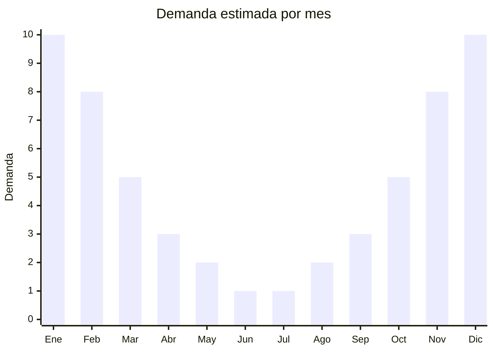

# Equipamiento de natación

> **Capítulo NCM 95** — Juguetes, juegos y artículos para recreo o deporte | **Temporada:** Verano (Dic–Feb)

## Qué es y por qué importarlo

El equipamiento de natación comprende accesorios para práctica recreativa y deportiva en agua: aletas (fins), tablas de natación (kickboards), gorros de silicona o látex, antiparras (goggles), tapones de oídos y clips nasales. Son productos esenciales para la temporada de pileta y playa, con demanda concentrada entre diciembre y febrero en Argentina.

El mercado está dividido entre marcas premium reconocidas (Speedo, Arena, TYR) que dominan el segmento competitivo/profesional, y marcas genéricas chinas que atienden el segmento recreativo masivo a precios accesibles. China produce la mayor parte del equipamiento de natación mundial, con fábricas en Guangdong, Zhejiang y Fujian especializadas en silicona, caucho y plásticos para uso acuático.

La oportunidad de importación está en el segmento recreativo: antiparras, gorros y aletas de calidad aceptable a precios FOB muy competitivos. El costo es bajo, el volumen y peso son mínimos, y los márgenes son generosos. Los tapones y clips nasales tienen un costo FOB de centavos y se venden en packs con margen excepcional.

## Datos clave

| Dato | Valor |
|------|-------|
| **Posiciones NCM típicas** | 9506.29.00 (artículos para deportes acuáticos), 9506.99.00 (artículos deportivos diversos) |
| **Derecho de importación** | 20% (DIE) + 3% tasa estadística |
| **Rango FOB típico** | USD 1.00 — USD 10.00 por unidad (según artículo) |
| **Precio de venta en Argentina** | ARS 3.000 — ARS 30.000 |
| **Margen bruto estimado** | 150% — 350% |
| **MOQ típico** | 200 — 1.000 unidades |
| **Demanda en MercadoLibre** | Alta (estacional) |
| **Competencia en MercadoLibre** | Media |
| **Dificultad para importar** | Fácil |
| **Certificaciones necesarias** | IRAM 3583 para modelos infantiles (menores de 14 años). No aplica para equipamiento adulto. |
| **Antidumping** | No |

## Variantes y subtipos más comunes

| Subtipo / Variante | FOB aprox. | Venta AR aprox. | Nota |
|--------------------|-----------|-----------------|------|
| Antiparras natación adulto | USD 1.00 — 3.00 | ARS 5.000 — 15.000 | **Más vendido**, silicona + policarbonato |
| Antiparras natación infantil | USD 1.00 — 2.50 | ARS 4.000 — 10.000 | Requiere IRAM 3583 |
| Gorro silicona adulto | USD 0.80 — 2.00 | ARS 3.000 — 8.000 | Estampados, colores lisos |
| Gorro silicona infantil | USD 0.80 — 1.50 | ARS 3.000 — 6.000 | Diseños animales, requiere IRAM |
| Aletas cortas adulto | USD 4.00 — 8.00 | ARS 15.000 — 30.000 | Entrenamiento, snorkel |
| Aletas infantiles | USD 3.00 — 6.00 | ARS 10.000 — 22.000 | Requiere IRAM 3583 |
| Tabla de natación (kickboard) | USD 2.00 — 5.00 | ARS 8.000 — 18.000 | EVA flotante, entrenamiento |
| Pack tapones + clip nasal | USD 0.30 — 1.00 | ARS 2.000 — 5.000 | Margen excepcional |
| Set natación (antiparra + gorro + tapones) | USD 2.00 — 4.00 | ARS 6.000 — 15.000 | Kit completo, gran percepción de valor |

## Regulaciones y requisitos

<Tabs>
  <Tab title="Certificaciones">
    | Organismo | Requiere | Detalle |
    |-----------|----------|---------|
    | ARCA (Aduana) | Sí siempre | Despacho estándar |
    | IRAM 3583 | Condicional | **Obligatorio para equipamiento infantil (menores de 14 años).** No aplica para equipamiento adulto/deportivo. |
    | ANMAT | No | No aplica |
    | ENACOM | No | No es electrónico |
    | SENASA | No | No aplica |

    <Warning>
    **IRAM 3583 es obligatorio** para equipamiento de natación comercializado para menores de 14 años. Esto incluye antiparras infantiles, gorros con diseños para niños, aletas infantiles y cualquier producto cuyo packaging o marketing lo destine a menores. El equipamiento deportivo para adultos (competición, entrenamiento) no requiere IRAM 3583. Verificar que los materiales en contacto con la piel (silicona, caucho) cumplan con límites de sustancias nocivas.
    </Warning>
  </Tab>

  <Tab title="Etiquetado">
    | Requisito | Aplica |
    |-----------|--------|
    | Idioma español | Sí |
    | Datos del importador | Sí |
    | Composición / materiales | Sí (silicona, policarbonato, PVC, EVA) |
    | Talles disponibles | Sí (aletas) |
    | País de origen | Sí |
    | Garantía legal 6 meses | Sí |
    | Protección UV en lentes | Recomendado (antiparras) |
    | Rango de edad (si infantil) | Sí |
    | Sello IRAM (si infantil) | Sí |
  </Tab>

  <Tab title="Restricciones">
    Equipamiento adulto sin restricciones especiales. Equipamiento infantil requiere IRAM 3583. No hay antidumping.

    **Atención:** Las antiparras deben tener lentes de policarbonato (no vidrio) para seguridad. Verificar que la protección UV sea real (certificado del proveedor) si se publicita como tal. Los gorros de látex pueden causar alergias; los de silicona son preferibles y más vendidos.
  </Tab>
</Tabs>

## Logística

| Dato | Valor |
|------|-------|
| **Peso típico por unidad** | 0.05 — 0.5 kg (según artículo) |
| **Volumen típico** | Muy Bajo (productos compactos) |
| **Fragilidad** | Baja (silicona, plástico flexible) |
| **Envío recomendado** | Marítimo LCL o consolidado |
| **Tiempo total estimado** | 50 — 80 días (marítimo) |
| **Baterías de litio** | No |
| **Requiere empaque especial** | No |

<Tip>
El equipamiento de natación es **ideal para consolidar** con otros productos de verano en un mismo envío. Antiparras, gorros y tapones pesan gramos y ocupan centímetros. Armar **sets combinados** (antiparra + gorro + tapones en blister) aumenta significativamente la percepción de valor y el ticket promedio de venta con mínimo costo adicional FOB. Pedir al proveedor que arme los sets en packaging atractivo.
</Tip>

## Estacionalidad



| Aspecto | Detalle |
|---------|---------|
| **Meses pico** | Diciembre-Febrero (verano, pileta, playa, vacaciones) |
| **Meses valle** | Junio-Agosto (invierno, piletas climatizadas mantienen demanda mínima) |
| **Cuándo pedir** | Julio-Agosto para tener stock en noviembre |

## Ventajas y riesgos

<CardGroup cols={2}>
  <Card title="Ventajas" icon="circle-check">
    - Costo FOB bajo, márgenes excelentes
    - Peso y volumen mínimos = flete ínfimo
    - Demanda masiva en verano
    - Sets combinados aumentan ticket promedio
    - Compra recurrente (se pierden, deterioran, cambian talle)
    - Ideal para combinar en envíos consolidados
  </Card>
  <Card title="Riesgos" icon="triangle-exclamation">
    - IRAM 3583 para modelos infantiles
    - Calidad de silicona variable (olor, durabilidad)
    - Antiparras baratas empañan rápido
    - Competencia con marcas posicionadas (Speedo, Arena)
    - Talles de aletas requieren gestión de inventario
    - Estacionalidad marcada (aunque piletas climatizadas dan base)
  </Card>
</CardGroup>

## Palabras clave para buscar en Alibaba

```
swimming goggles wholesale, swim cap silicone wholesale, swimming fins short wholesale,
kickboard swimming EVA, ear plugs nose clip swim set, swimming goggles anti fog,
swimming accessories set wholesale, swim training equipment bulk
```

## Fuentes

- [MercadoLibre Argentina — Antiparras natación](https://listado.mercadolibre.com.ar/antiparras-natacion)
- [MercadoLibre Argentina — Aletas natación](https://listado.mercadolibre.com.ar/aletas-natacion)
- [Alibaba — Swimming goggles wholesale](https://www.alibaba.com/showroom/swimming-goggles.html)
- [IRAM — Norma 3583 Seguridad de juguetes](https://www.iram.org.ar)
