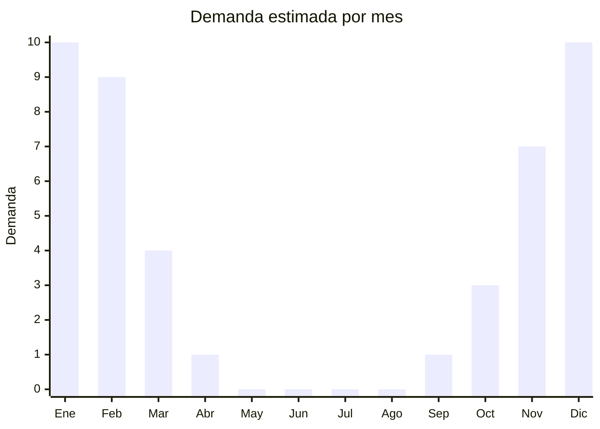

# Flotadores, colchonetas y boyas inflables

> **Capítulo NCM 95** — Juguetes, juegos y artículos para recreo o deporte | **Temporada:** Verano (Dic–Feb)

## Qué es y por qué importarlo

Los flotadores y colchonetas inflables son productos de PVC diseñados para flotar en piletas, ríos, lagos y el mar. Incluyen desde los clásicos salvavidas inflables hasta las colchonetas con forma de unicornio, flamenco, dona, pizza y otras figuras que se convirtieron en tendencia viral gracias a Instagram y TikTok. Son productos aspiracionales de bajo costo que combinan diversión, estética para redes sociales y funcionalidad.

China domina completamente la producción mundial de inflables recreativos. Fábricas en Guangdong y Zhejiang producen para marcas globales como Intex, Bestway y también para miles de marcas blancas. Los modelos tipo "instagrameables" (flamenco gigante, unicornio, donut) tienen márgenes excepcionales porque el costo FOB es bajo y la percepción de valor del consumidor es alta.

La ventaja logística es notable: desinflados, estos productos ocupan una fracción de su volumen real. Un flotador flamenco de 1.5 metros cabe plegado en una bolsa de 30x20cm. Esto permite transportar grandes cantidades con flete reducido. El desafío principal es la estacionalidad y la necesidad de renovar diseños cada temporada para mantener el factor novedad.

## Datos clave

| Dato | Valor |
|------|-------|
| **Posiciones NCM típicas** | 9503.00.99 (juguetes inflables — infantiles), 9506.29.00 (artículos para deportes acuáticos — adultos) |
| **Derecho de importación** | 20% (DIE) + 3% tasa estadística |
| **Rango FOB típico** | USD 2.00 — USD 15.00 por unidad |
| **Precio de venta en Argentina** | ARS 8.000 — ARS 50.000 |
| **Margen bruto estimado** | 150% — 350% |
| **MOQ típico** | 200 — 1.000 unidades |
| **Demanda en MercadoLibre** | Muy Alta (estacional) |
| **Competencia en MercadoLibre** | Media-Alta |
| **Dificultad para importar** | Fácil (bajo volumen desinflado) |
| **Certificaciones necesarias** | IRAM 3583 obligatorio para flotadores infantiles (menores de 14 años) |
| **Antidumping** | No |

## Variantes y subtipos más comunes

| Subtipo / Variante | FOB aprox. | Venta AR aprox. | Nota |
|--------------------|-----------|-----------------|------|
| Flotador rosquilla/dona | USD 2.00 — 4.00 | ARS 8.000 — 15.000 | Clásico Instagram |
| Flotador flamenco grande | USD 5.00 — 10.00 | ARS 18.000 — 35.000 | **Más vendido**, ícono verano |
| Flotador unicornio grande | USD 5.00 — 10.00 | ARS 18.000 — 35.000 | Tendencia constante |
| Colchoneta inflable clásica | USD 2.00 — 5.00 | ARS 8.000 — 20.000 | Para tomar sol en el agua |
| Flotador infantil con asiento | USD 2.00 — 5.00 | ARS 8.000 — 18.000 | Requiere IRAM 3583 |
| Flotador isla/grupo (4-6 personas) | USD 10.00 — 15.00 | ARS 35.000 — 50.000 | Premium, alto ticket |
| Boya salvavidas clásica | USD 2.00 — 4.00 | ARS 6.000 — 12.000 | Uso recreativo/seguridad |

## Regulaciones y requisitos

<Tabs>
  <Tab title="Certificaciones">
    | Organismo | Requiere | Detalle |
    |-----------|----------|---------|
    | ARCA (Aduana) | Sí siempre | Despacho estándar |
    | IRAM 3583 | Condicional | **Obligatorio para flotadores destinados a menores de 14 años** (con asiento, diseños infantiles, etc.) |
    | ANMAT | No | No aplica |
    | ENACOM | No | No es electrónico |
    | SENASA | No | No aplica |

    <Warning>
    **IRAM 3583 es obligatorio** para flotadores y colchonetas comercializados como juguetes infantiles o destinados a menores de 14 años. Esto incluye flotadores con asiento para bebés, flotadores con diseños infantiles en el packaging, y cualquier modelo cuya publicidad o etiquetado indique uso para niños. Los flotadores tipo "instagrameables" (flamenco, unicornio) para adultos no requieren IRAM 3583 si el packaging no los presenta como juguete infantil. Siempre incluir advertencia: "No es un dispositivo de seguridad. No reemplaza la supervisión de un adulto."
    </Warning>
  </Tab>

  <Tab title="Etiquetado">
    | Requisito | Aplica |
    |-----------|--------|
    | Idioma español | Sí |
    | Datos del importador | Sí |
    | Composición / materiales | Sí (tipo de PVC, espesor) |
    | Dimensiones inflado | Sí |
    | Capacidad de peso máximo | Sí |
    | País de origen | Sí |
    | Garantía legal 6 meses | Sí |
    | Advertencia "No es salvavidas" | Sí (obligatorio) |
    | Rango de edad (si infantil) | Sí |
  </Tab>

  <Tab title="Restricciones">
    Flotadores adultos no tienen restricciones especiales. Los infantiles requieren IRAM 3583. No hay antidumping.

    **Atención:** Nunca presentar un flotador inflable como "dispositivo de seguridad" o "salvavidas". No son elementos de seguridad homologados. El etiquetado debe indicar claramente que no reemplazan la supervisión adulta ni son dispositivos de flotación de seguridad.
  </Tab>
</Tabs>

## Logística

| Dato | Valor |
|------|-------|
| **Peso típico por unidad** | 0.3 — 2.0 kg |
| **Volumen típico** | Muy Bajo desinflados (excelente ratio) |
| **Fragilidad** | Baja |
| **Envío recomendado** | Marítimo LCL o consolidado |
| **Tiempo total estimado** | 50 — 80 días (marítimo) |
| **Baterías de litio** | No |
| **Requiere empaque especial** | No |

<Tip>
Los flotadores desinflados ocupan una fracción de su tamaño inflado. Un flotador flamenco de 1.5m plegado cabe en una caja de 30x20x10cm. Esto los convierte en **productos ideales para consolidar** con artículos más pesados/voluminosos. Un pallet de flotadores puede contener 500+ unidades. Verificar que el proveedor incluya parche de reparación y, en modelos grandes, bomba de inflado manual.
</Tip>

## Estacionalidad



| Aspecto | Detalle |
|---------|---------|
| **Meses pico** | Diciembre-Febrero (verano, pileta, vacaciones) |
| **Meses valle** | Mayo-Septiembre (sin demanda) |
| **Cuándo pedir** | Julio-Agosto para tener stock en noviembre |

## Ventajas y riesgos

<CardGroup cols={2}>
  <Card title="Ventajas" icon="circle-check">
    - Desinflados = volumen mínimo, flete muy económico
    - Alto impacto visual, producto "instagrameable"
    - Márgenes generosos (especialmente modelos figurativos)
    - Demanda masiva y creciente cada verano
    - Bajo costo FOB permite amplio surtido de modelos
    - Se pinchan/deterioran = recompra cada temporada
  </Card>
  <Card title="Riesgos" icon="triangle-exclamation">
    - Tendencias cambian: lo viral un verano puede no repetir
    - IRAM 3583 para modelos infantiles
    - PVC fino puede pincharse fácil (verificar espesor mínimo 0.25mm)
    - Válvulas de inflado de baja calidad = quejas post-venta
    - 100% estacional: stock sobrante queda hasta próximo verano
    - Olor fuerte a PVC en modelos baratos (verificar calidad)
  </Card>
</CardGroup>

## Palabras clave para buscar en Alibaba

```
inflatable pool float wholesale, flamingo float inflatable, unicorn pool float,
inflatable mattress pool, donut pool float, giant inflatable float,
inflatable island float group, baby swim float seat ring, pool float custom shape
```

## Fuentes

- [MercadoLibre Argentina — Flotadores inflables](https://listado.mercadolibre.com.ar/flotadores-inflables)
- [MercadoLibre Argentina — Colchonetas inflables](https://listado.mercadolibre.com.ar/colchoneta-inflable-pileta)
- [Alibaba — Inflatable pool float wholesale](https://www.alibaba.com/showroom/inflatable-pool-float.html)
- [IRAM — Norma 3583 Seguridad de juguetes](https://www.iram.org.ar)
