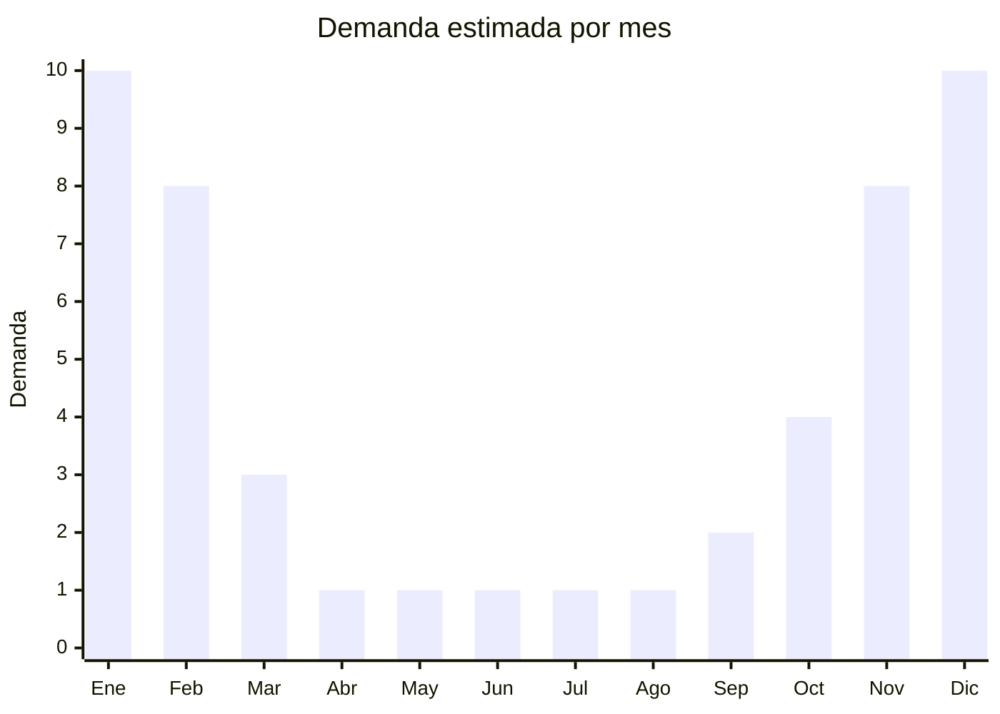

# Flotadores inflables

> **Capítulo NCM 95** — Juguetes, juegos y artículos para recreo o deporte | **Temporada:** Verano (Dic–Feb)

## Qué es y por qué importarlo

Los flotadores inflables incluyen aros inflables para adultos y niños, chalecos inflables infantiles, flotadores con formas temáticas (dona, pizza, flamenco), flotadores tipo sillón con portavasos, y flotadores infantiles con techo solar protector. Son productos esenciales de la temporada de pileta y playa, con demanda masiva y concentrada 100% en los meses de verano argentino (diciembre a febrero).

El segmento infantil es especialmente fuerte: los flotadores con techo solar para bebés/niños pequeños (6 meses a 3 años) se convirtieron en un producto indispensable para padres que van a la pileta o playa con hijos. Los flotadores con formas temáticas (dona gigante, pizza, unicornio) siguen siendo populares entre adolescentes y adultos jóvenes por su componente "instagrameable". Los aros inflables clásicos mantienen una demanda base sólida por su versatilidad y bajo precio.

China produce prácticamente el 100% de los flotadores inflables del mercado mundial, con fábricas en Shantou (Guangdong) y Yiwu (Zhejiang) que ofrecen precios FOB desde USD 0.50 por unidad para modelos básicos. Los márgenes en Argentina son muy atractivos, especialmente considerando que el producto desinflado ocupa mínimo espacio de envío.

<Warning>
**Nunca comercializar como "salvavidas".** Si un flotador se vende como dispositivo de seguridad acuática o salvamento, puede requerir certificación de la Prefectura Naval Argentina. Siempre etiquetar y publicar como "flotador recreativo" o "flotador de entretenimiento" e incluir la advertencia: "Este producto no es un dispositivo de seguridad. No sustituye la supervisión de un adulto."
</Warning>

## Datos clave

| Dato | Valor |
|------|-------|
| **Posiciones NCM típicas** | 9506.29.00 (artículos para natación/deportes acuáticos), 3926.90.90 (otras manufacturas plásticas) |
| **Derecho de importación** | 18-20% (DIE) + 3% tasa estadística |
| **Rango FOB típico** | USD 0.50 — USD 5.00 por unidad |
| **Precio de venta en Argentina** | ARS 3.000 — ARS 20.000 |
| **Margen bruto estimado** | 200% — 500% |
| **MOQ típico** | 200 — 1,000 unidades |
| **Demanda en MercadoLibre** | Muy Alta (100% estacional) |
| **Competencia en MercadoLibre** | Alta |
| **Dificultad para importar** | Fácil |
| **Certificaciones necesarias** | No requiere si se vende como recreativo (no como salvavidas) |
| **Antidumping** | No |

## Variantes y subtipos más comunes

| Subtipo / Variante | FOB aprox. | Venta AR aprox. | Nota |
|--------------------|-----------|-----------------|------|
| Aro inflable adulto (80-90cm) | USD 0.50 — 1.50 | ARS 3.000 — 6.000 | Clásico, alta rotación |
| Flotador infantil con techo solar | USD 2.00 — 4.00 | ARS 8.000 — 18.000 | **Más vendido** — padres |
| Flotador forma (dona/pizza/flamenco) | USD 1.50 — 4.00 | ARS 6.000 — 15.000 | Tendencia redes sociales |
| Chaleco inflable infantil | USD 1.00 — 3.00 | ARS 4.000 — 12.000 | Seguridad infantil |
| Flotador sillón con portavasos | USD 2.00 — 5.00 | ARS 7.000 — 20.000 | Adultos, relajación |

## Regulaciones y requisitos

<Tabs>
  <Tab title="Certificaciones">
    | Organismo | Requiere | Detalle |
    |-----------|----------|---------|
    | ARCA (Aduana) | Sí siempre | Despacho estándar |
    | IRAM 3583 | Condicional | Si se comercializa como juguete para menores de 14 años |
    | Prefectura Naval | Condicional | Solo si se etiqueta como "salvavidas" o dispositivo de seguridad |
    | ENACOM | No | No es electrónico |

    **Recomendación:** Etiquetar como "flotador recreativo" para evitar la certificación de Prefectura Naval. Los flotadores infantiles que se venden como juguete sí deben cumplir IRAM 3583. Consultar con despachante la clasificación exacta.
  </Tab>

  <Tab title="Etiquetado">
    | Requisito | Aplica |
    |-----------|--------|
    | Idioma español | Sí |
    | Datos del importador | Sí |
    | Advertencia "No es salvavidas" | **Sí, obligatorio** |
    | Advertencia supervisión adulta | Sí (especialmente infantiles) |
    | Rango de edad (si infantil) | Sí |
    | Peso máximo soportado | Recomendado |
    | Composición / materiales | Sí (PVC, vinilo) |
    | País de origen | Sí |
    | Garantía legal 6 meses | Sí |
  </Tab>

  <Tab title="Restricciones">
    Sin restricciones de importación específicas para flotadores recreativos. No hay antidumping.

    **Línea crítica salvavidas vs. recreativo:** La diferencia entre un producto que requiere certificación de Prefectura y uno que no, está en cómo se comercializa. Si la publicación dice "salvavidas", "dispositivo de flotación de seguridad" o "elemento de salvamento", entra en regulación de Prefectura Naval. Si dice "flotador recreativo", "inflable para pileta" o "flotador de entretenimiento", no requiere certificación adicional.
  </Tab>
</Tabs>

## Logística

| Dato | Valor |
|------|-------|
| **Peso típico por unidad** | 0.1 — 0.8 kg (desinflados) |
| **Volumen típico** | Muy Bajo (desinflados y doblados) |
| **Fragilidad** | Baja (PVC flexible) |
| **Envío recomendado** | Marítimo LCL (e incluso aéreo para urgencias) |
| **Tiempo total estimado** | 45 — 75 días (marítimo) |
| **Baterías de litio** | No |
| **Requiere empaque especial** | No |

<Tip>
Los flotadores desinflados son uno de los productos con mejor ratio volumen/precio de venta. Un pedido de 1,000 aros inflables puede caber en apenas 1-2 CBM. Esto los hace viables incluso por **envío aéreo** si se necesita reabastecer urgente en plena temporada (el costo aéreo sigue siendo absorbido por el margen).
</Tip>

## Estacionalidad



| Aspecto | Detalle |
|---------|---------|
| **Meses pico** | Diciembre-Enero (regalos Navidad + pico uso verano) |
| **Meses valle** | Abril-Septiembre (prácticamente cero demanda) |
| **Cuándo pedir** | Agosto-Septiembre para tener stock en noviembre |

## Ventajas y riesgos

<CardGroup cols={2}>
  <Card title="Ventajas" icon="circle-check">
    - Márgenes excepcionales (200-500%)
    - Producto ultra liviano, flete mínimo
    - Sin regulación compleja (si se vende como recreativo)
    - Demanda predecible y masiva en verano
    - Bajo ticket = compra impulsiva, alta rotación
  </Card>
  <Card title="Riesgos" icon="triangle-exclamation">
    - 100% estacional: stock remanente queda un año
    - PVC de baja calidad se pincha al primer uso
    - Válvulas defectuosas generan devoluciones
    - Riesgo legal si se malinterpreta como "salvavidas"
    - Competencia masiva de importadores con precios bajos
  </Card>
</CardGroup>

## Palabras clave para buscar en Alibaba

```
inflatable swim ring wholesale, baby float with canopy sun shade,
inflatable pool float donut, inflatable swim vest kids,
pool float chair with cup holder, giant inflatable ring,
flamingo swim ring, baby swimming float canopy, PVC swim ring wholesale
```

## Fuentes

- [MercadoLibre Argentina — Flotadores inflables](https://listado.mercadolibre.com.ar/flotador-inflable)
- [Alibaba — Inflatable swim ring wholesale](https://www.alibaba.com/showroom/inflatable-swim-ring.html)
