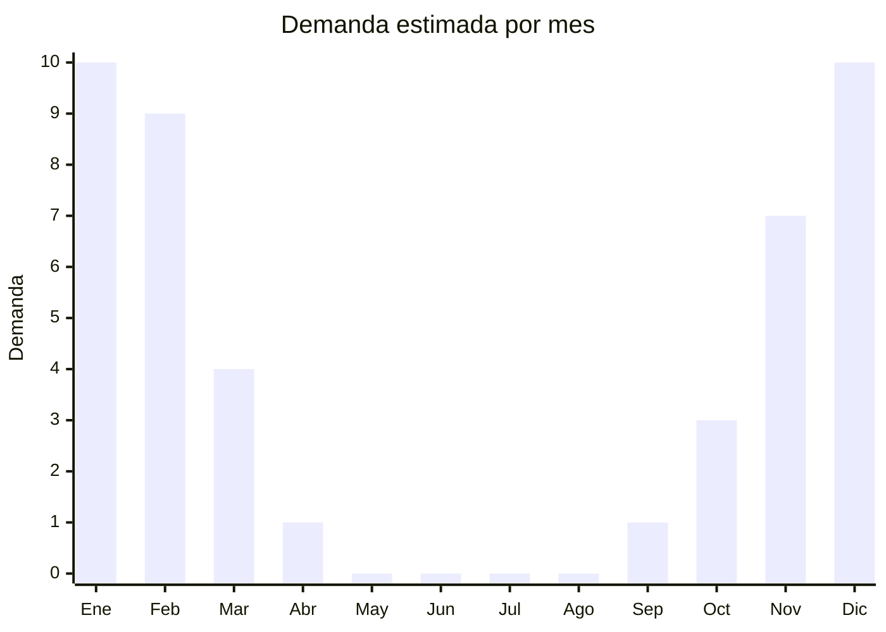

# Juguetes de agua

> **Capítulo NCM 95** — Juguetes, juegos y artículos para recreo o deporte | **Temporada:** Verano (Dic–Feb)

## Qué es y por qué importarlo

Los juguetes de agua incluyen pistolas de agua (water guns), rociadores de jardín para niños, globos de agua (water balloons) y sistemas de juego acuático como sprinklers infantiles y mangueras con figuras. Son productos 100% estacionales que explotan en ventas durante el verano argentino, especialmente entre diciembre y febrero cuando las temperaturas superan los 30°C.

China es el productor prácticamente exclusivo de juguetes de agua a nivel mundial. Fábricas en Shantou (Guangdong), conocida como la "capital del juguete", y en Yiwu (Zhejiang) producen desde pistolas económicas de USD 1 hasta modelos con presurización mecánica tipo Nerf Super Soaker. Una tendencia que revolucionó el mercado son los Bunch O Balloons (globos de agua de llenado rápido), que permiten llenar y atar 100 globos en 60 segundos conectando a la manguera. Las versiones genéricas chinas son extremadamente económicas y se venden masivamente.

La ventaja de estos productos es su bajo costo FOB, alto volumen de ventas en temporada, y márgenes generosos. El riesgo principal es la estacionalidad total: fuera del verano, la demanda es prácticamente cero.

## Datos clave

| Dato | Valor |
|------|-------|
| **Posiciones NCM típicas** | 9503.00.99 (juguetes varios) |
| **Derecho de importación** | 20% (DIE) + 3% tasa estadística |
| **Rango FOB típico** | USD 1.00 — USD 8.00 por unidad |
| **Precio de venta en Argentina** | ARS 5.000 — ARS 35.000 |
| **Margen bruto estimado** | 200% — 400% |
| **MOQ típico** | 500 — 2.000 unidades |
| **Demanda en MercadoLibre** | Muy Alta (estacional) |
| **Competencia en MercadoLibre** | Media |
| **Dificultad para importar** | Fácil (bajo peso, bajo volumen) |
| **Certificaciones necesarias** | IRAM 3583 obligatorio (juguete para menores de 14 años) |
| **Antidumping** | No |

## Variantes y subtipos más comunes

| Subtipo / Variante | FOB aprox. | Venta AR aprox. | Nota |
|--------------------|-----------|-----------------|------|
| Pistola de agua chica (20-30cm) | USD 1.00 — 2.00 | ARS 5.000 — 10.000 | Económica, alto volumen |
| Pistola de agua mediana con tanque | USD 2.00 — 4.00 | ARS 10.000 — 18.000 | **Más vendida** |
| Pistola presurizada grande | USD 4.00 — 8.00 | ARS 18.000 — 35.000 | Estilo Super Soaker |
| Globos de agua rápidos (pack 100+) | USD 1.00 — 2.50 | ARS 5.000 — 12.000 | Tendencia Bunch O Balloons |
| Rociador/sprinkler infantil | USD 3.00 — 6.00 | ARS 12.000 — 25.000 | Se conecta a manguera |
| Manguera con figura inflable | USD 4.00 — 7.00 | ARS 15.000 — 30.000 | Arco de agua, animales |

## Regulaciones y requisitos

<Tabs>
  <Tab title="Certificaciones">
    | Organismo | Requiere | Detalle |
    |-----------|----------|---------|
    | ARCA (Aduana) | Sí siempre | Despacho estándar |
    | IRAM 3583 | Sí | **Obligatorio. Todos los juguetes de agua son productos destinados a menores de 14 años.** |
    | ANMAT | No | No aplica |
    | ENACOM | No | No es electrónico (modelos manuales) |
    | SENASA | No | No aplica |

    <Warning>
    **IRAM 3583 es obligatorio** para todos los juguetes de agua sin excepción. Son productos diseñados y destinados a niños menores de 14 años. El certificado debe tramitarse antes del despacho aduanero. Coordinar con un laboratorio acreditado (ej: INTI, Bureau Veritas, SGS) para obtener la certificación. Prever 30-60 días adicionales y un costo aproximado de USD 500-1.500 por línea de producto.
    </Warning>
  </Tab>

  <Tab title="Etiquetado">
    | Requisito | Aplica |
    |-----------|--------|
    | Idioma español | Sí |
    | Datos del importador | Sí |
    | Composición / materiales | Sí (tipo de plástico) |
    | País de origen | Sí |
    | Garantía legal 6 meses | Sí |
    | Rango de edad recomendado | Sí (obligatorio en juguetes) |
    | Advertencias de seguridad | Sí (piezas pequeñas, supervisión adulta) |
    | Sello IRAM | Sí (visible en packaging) |
  </Tab>

  <Tab title="Restricciones">
    Todos los juguetes para menores de 14 años requieren certificación IRAM 3583. No hay antidumping ni licencias previas adicionales.

    **Atención:** Las pistolas de agua que incluyen baterías (modelos eléctricos automáticos) pueden requerir intervención de ENACOM. Verificar si el modelo tiene componentes electrónicos. Los globos de agua deben indicar advertencia de asfixia para menores de 3 años (piezas pequeñas).
  </Tab>
</Tabs>

## Logística

| Dato | Valor |
|------|-------|
| **Peso típico por unidad** | 0.1 — 0.8 kg |
| **Volumen típico** | Bajo-Medio (empaque compacto) |
| **Fragilidad** | Baja (plástico resistente) |
| **Envío recomendado** | Marítimo LCL o FCL según volumen |
| **Tiempo total estimado** | 50 — 80 días (marítimo) |
| **Baterías de litio** | No (modelos manuales) |
| **Requiere empaque especial** | No |

<Tip>
Los juguetes de agua son ideales para **combinar en un consolidado** con otros productos de verano (flotadores, sets de playa, pelotas). Su bajo peso y volumen permiten optimizar el espacio sobrante en un contenedor. Armar un mix de productos estacionales maximiza el retorno del flete.
</Tip>

## Estacionalidad



| Aspecto | Detalle |
|---------|---------|
| **Meses pico** | Diciembre-Febrero (verano, vacaciones, calor) |
| **Meses valle** | Mayo-Septiembre (demanda casi nula) |
| **Cuándo pedir** | Julio-Agosto para tener stock en noviembre |

## Ventajas y riesgos

<CardGroup cols={2}>
  <Card title="Ventajas" icon="circle-check">
    - Costo FOB muy bajo, márgenes altísimos
    - Demanda masiva en verano (todos los niños quieren)
    - Bajo peso y volumen = flete económico
    - Variedad enorme para diferenciar
    - Tendencia Bunch O Balloons con ventas explosivas
  </Card>
  <Card title="Riesgos" icon="triangle-exclamation">
    - 100% estacional: fuera del verano no se vende nada
    - IRAM 3583 obligatorio agrega costo y tiempo al despacho
    - Calidad de plástico variable (verificar que no se rompa al primer uso)
    - Pistolas baratas pueden tener fugas en juntas
    - Stock sobrante ocupa espacio 10 meses hasta próxima temporada
  </Card>
</CardGroup>

## Palabras clave para buscar en Alibaba

```
water gun wholesale, water pistol toy bulk, water balloon quick fill bunch,
water sprinkler toy kids, super soaker water blaster, splash pad mat children,
water balloons self sealing wholesale, garden sprinkler toy kids
```

## Fuentes

- [MercadoLibre Argentina — Pistolas de agua](https://listado.mercadolibre.com.ar/pistola-de-agua)
- [MercadoLibre Argentina — Globos de agua](https://listado.mercadolibre.com.ar/globos-de-agua)
- [Alibaba — Water gun toy wholesale](https://www.alibaba.com/showroom/water-gun-toy.html)
- [IRAM — Norma 3583 Seguridad de juguetes](https://www.iram.org.ar)
