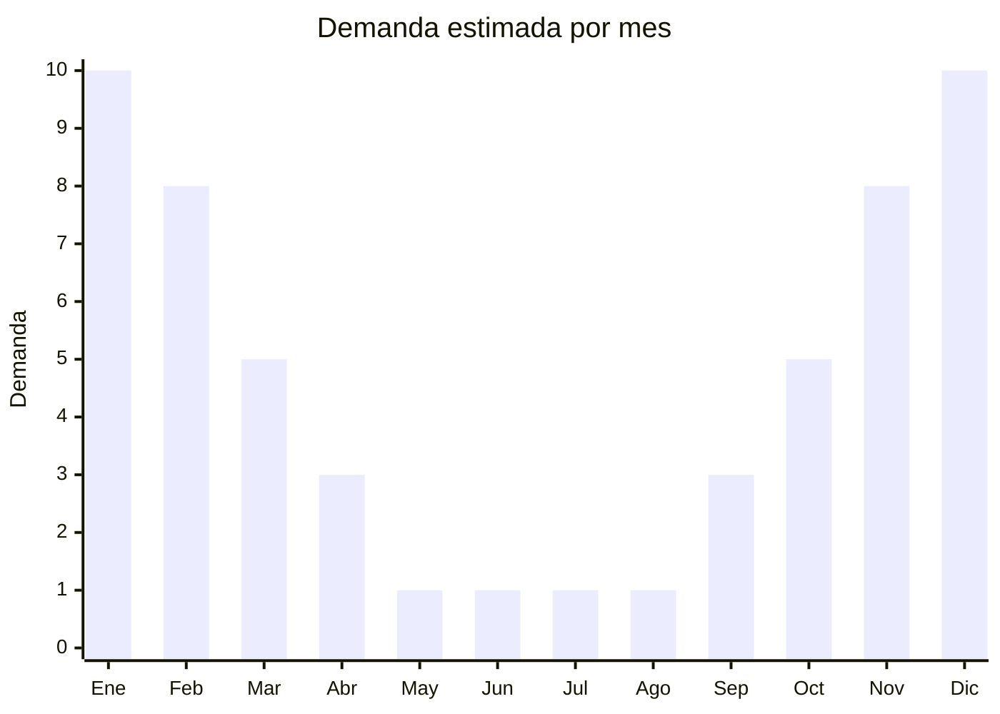

# Kayaks y tablas de SUP inflables

> **Capítulo NCM 95** — Juguetes, juegos y artículos para recreo o deporte | **Temporada:** Verano (Dic–Feb)

## Qué es y por qué importarlo

Los kayaks inflables y las tablas de SUP (Stand Up Paddle) inflables son embarcaciones recreativas portátiles fabricadas en PVC reforzado con tecnología drop-stitch que permite alcanzar rigidez similar a un modelo rígido una vez infladas a alta presión (15 PSI). Son la tendencia de mayor crecimiento en deportes acuáticos recreativos a nivel mundial, y Argentina no es la excepción.

El SUP inflable se ha convertido en el producto estrella del segmento: permite remar de pie en lagos, ríos, mar calmo y lagunas, es fácil de transportar (cabe en una mochila), no requiere portaequipaje en el auto, y se guarda en un closet. Los kayaks inflables ofrecen una experiencia de kayak tradicional con la misma portabilidad. China es el centro de producción mundial, con fábricas en Xiamen (Fujian), Guangdong y Zhejiang que producen para marcas globales como Aqua Marina, Red Paddle Co, Intex y decenas de marcas blancas.

El ticket de venta es alto (USD 300-800 equivalente), lo que genera márgenes absolutos significativos. La ventaja logística clave es que desinflados y empacados, un SUP de 10'6" cabe en una caja de 90x40x30cm, lo que permite transportar cientos de unidades en un contenedor.

## Datos clave

| Dato | Valor |
|------|-------|
| **Posiciones NCM típicas** | 9506.29.00 (artículos para deportes acuáticos) |
| **Derecho de importación** | 20% (DIE) + 3% tasa estadística |
| **Rango FOB típico** | USD 50.00 — USD 200.00 (SUP), USD 80.00 — USD 250.00 (kayak) |
| **Precio de venta en Argentina** | ARS 200.000 — ARS 700.000 |
| **Margen bruto estimado** | 80% — 150% |
| **MOQ típico** | 20 — 100 unidades |
| **Demanda en MercadoLibre** | Media-Alta (en crecimiento) |
| **Competencia en MercadoLibre** | Media |
| **Dificultad para importar** | Media |
| **Certificaciones necesarias** | No requiere IRAM 3583 (no es juguete, es equipamiento deportivo adulto) |
| **Antidumping** | No |

## Variantes y subtipos más comunes

| Subtipo / Variante | FOB aprox. | Venta AR aprox. | Nota |
|--------------------|-----------|-----------------|------|
| SUP inflable 10'6" all-around | USD 60.00 — 100.00 | ARS 250.000 — 400.000 | **Más vendido**, versátil |
| SUP inflable 11' touring | USD 80.00 — 130.00 | ARS 350.000 — 500.000 | Recorridos largos, más estable |
| SUP inflable 9' kids/compacto | USD 50.00 — 80.00 | ARS 200.000 — 300.000 | Niños y usuarios livianos |
| SUP inflable premium (doble capa) | USD 120.00 — 200.00 | ARS 450.000 — 700.000 | Mayor rigidez y durabilidad |
| Kayak inflable 1 persona | USD 80.00 — 150.00 | ARS 300.000 — 500.000 | Con asiento y remo incluido |
| Kayak inflable 2 personas | USD 120.00 — 250.00 | ARS 400.000 — 700.000 | Familiar, mayor capacidad |
| Remo aluminio SUP | USD 8.00 — 15.00 | ARS 30.000 — 60.000 | Accesorio esencial, 3 piezas |

## Regulaciones y requisitos

<Tabs>
  <Tab title="Certificaciones">
    | Organismo | Requiere | Detalle |
    |-----------|----------|---------|
    | ARCA (Aduana) | Sí siempre | Despacho estándar |
    | IRAM 3583 | No | No es juguete, es equipamiento deportivo/recreativo para adultos |
    | Prefectura Naval Argentina (PNA) | Condicional | Embarcaciones recreativas pueden requerir registro según uso y zona de navegación |
    | ANMAT | No | No aplica |
    | ENACOM | No | No es electrónico |
    | SENASA | No | No aplica |

    **Nota:** Los kayaks y SUP inflables son equipamiento deportivo acuático para adultos, no juguetes. No requieren certificación IRAM 3583. Sin embargo, como embarcaciones recreativas, su uso en aguas argentinas puede estar regulado por Prefectura Naval Argentina (PNA) dependiendo de la zona de navegación. Esto no afecta la importación sino el uso final. Contar con certificados de presión máxima y resistencia del PVC del proveedor agrega valor comercial.
  </Tab>

  <Tab title="Etiquetado">
    | Requisito | Aplica |
    |-----------|--------|
    | Idioma español | Sí |
    | Datos del importador | Sí |
    | Composición / materiales | Sí (tipo de PVC, drop-stitch, capas) |
    | Dimensiones inflado | Sí |
    | Capacidad de peso máximo | Sí (crítico) |
    | Presión máxima de inflado (PSI) | Sí |
    | País de origen | Sí |
    | Garantía legal 6 meses | Sí |
    | Manual de uso y seguridad | Sí |
    | Advertencia uso de chaleco salvavidas | Sí |
  </Tab>

  <Tab title="Restricciones">
    Sin restricciones especiales de importación. No hay antidumping, licencias previas ni IRAM.

    **Atención:** Incluir siempre advertencia de que el uso de chaleco salvavidas es obligatorio y que no se debe usar en condiciones de mar/río peligrosas. Los SUP no son embarcaciones de seguridad. Si el kit incluye bomba eléctrica con batería de litio, verificar regulaciones de transporte de baterías de litio para envío marítimo.
  </Tab>
</Tabs>

## Logística

| Dato | Valor |
|------|-------|
| **Peso típico por unidad** | 8 — 15 kg (SUP con accesorios), 10 — 18 kg (kayak con accesorios) |
| **Volumen típico** | Medio (empacado en mochila/caja compacta) |
| **Fragilidad** | Baja (PVC resistente, empaque compacto) |
| **Envío recomendado** | Marítimo LCL o FCL según volumen |
| **Tiempo total estimado** | 50 — 80 días (marítimo) |
| **Baterías de litio** | Solo si incluye bomba eléctrica (verificar) |
| **Requiere empaque especial** | No, mochila de transporte incluida |

<Tip>
Los SUP y kayaks inflables desinflados se empaquetan en cajas de aprox. 90x40x30cm, lo que permite apilar eficientemente en contenedor. Un contenedor 20' puede llevar 200-300 SUPs. La clave es negociar que el **kit completo** (tabla + remo 3 piezas + bomba manual + quilla + leash + mochila + kit de reparación) venga en una sola caja. Esto evita costos de armado y empaque local. Verificar que la bomba sea de doble acción (infla al empujar y al tirar) para inflar más rápido.
</Tip>

## Estacionalidad



| Aspecto | Detalle |
|---------|---------|
| **Meses pico** | Noviembre-Febrero (verano, lagos, río, mar) |
| **Meses valle** | Mayo-Agosto (agua fría, sin demanda) |
| **Cuándo pedir** | Julio-Agosto para tener stock en noviembre |

## Ventajas y riesgos

<CardGroup cols={2}>
  <Card title="Ventajas" icon="circle-check">
    - Ticket alto = márgenes absolutos significativos
    - Tendencia creciente: deporte de moda en todo el mundo
    - Desinflados = volumen compacto para transporte
    - No requiere IRAM ni certificaciones complejas
    - Producto aspiracional con público dispuesto a pagar
    - MOQ bajo (20-100 unidades para empezar)
  </Card>
  <Card title="Riesgos" icon="triangle-exclamation">
    - Inversión inicial alta por el costo FOB elevado
    - Calidad del drop-stitch variable (verificar presión y rigidez)
    - Competencia con Aqua Marina y marcas posicionadas
    - Producto estacional con ticket alto = stock parado costoso
    - Requiere post-venta (reparaciones, repuestos de válvulas)
    - Peso considerable por unidad (10-18 kg con accesorios)
  </Card>
</CardGroup>

## Palabras clave para buscar en Alibaba

```
inflatable SUP board wholesale, stand up paddle board inflatable, inflatable kayak wholesale,
SUP board drop stitch PVC, inflatable paddle board set complete, inflatable kayak 2 person,
stand up paddle board factory OEM, SUP board custom design wholesale
```

## Fuentes

- [MercadoLibre Argentina — Tablas de SUP](https://listado.mercadolibre.com.ar/tabla-sup-inflable)
- [MercadoLibre Argentina — Kayaks inflables](https://listado.mercadolibre.com.ar/kayak-inflable)
- [Alibaba — Inflatable SUP board wholesale](https://www.alibaba.com/showroom/inflatable-sup-board.html)
