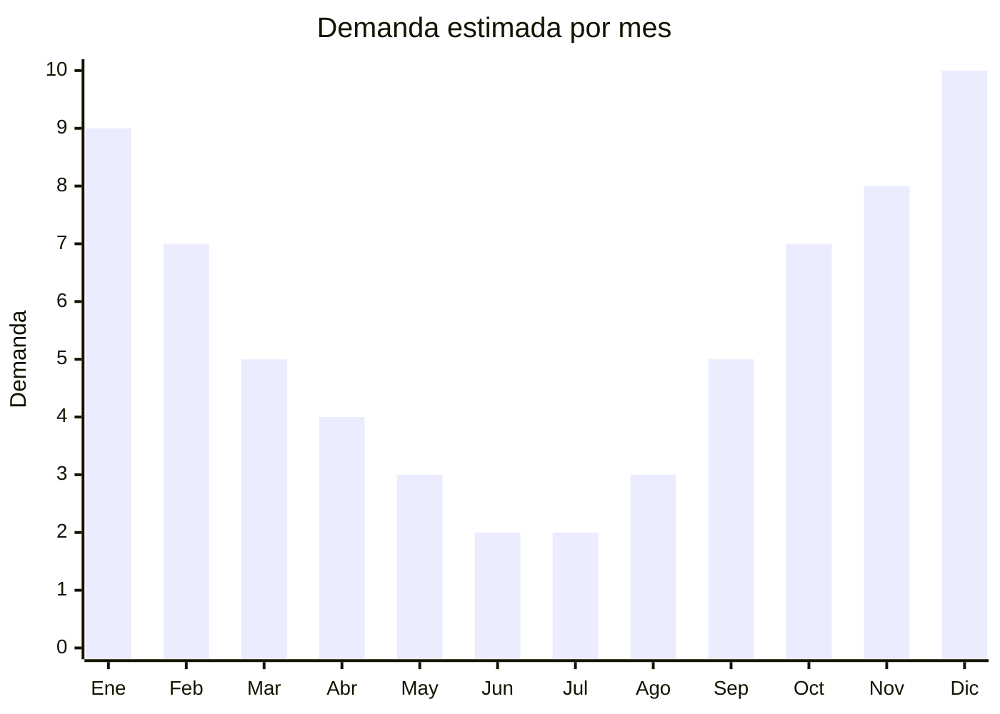

# Patinetas (skateboards) y longboards

> **Capítulo NCM 95** — Juguetes, juegos y artículos para recreo o deporte | **Temporada:** Verano (Dic–Feb)

## Qué es y por qué importarlo

Las patinetas (skateboards) y longboards son tablas con ruedas para desplazamiento, deporte y recreación al aire libre. El skateboard clásico (31" x 8") se usa para tricks y skatepark, mientras que el longboard (36-42") es para cruising, paseo y descenso. Ambas categorías tienen demanda creciente en Argentina, especialmente entre jóvenes de 12 a 30 años, y el pico de uso y venta coincide con el verano cuando las actividades al aire libre se multiplican.

China domina la producción mundial de skateboards económicos y de rango medio. Las tablas se fabrican con maple chino (arce) de 7 capas, que ofrece buena relación calidad-precio para el segmento entry-level y medio. Las fábricas se concentran en Zhejiang y Guangdong. Marcas argentinas populares como Woodoo, Alaniz y otras importan directamente de estas fábricas OEM. El segmento premium (tablas canadienses) es un nicho separado con menor volumen.

Los trucks (ejes), ruedas y rodamientos son componentes clave que definen la calidad del producto. Las fábricas chinas producen sets completos (tabla + trucks + ruedas + rodamientos) o componentes sueltos. Los completos económicos tienen excelente margen y alta rotación, mientras que los componentes sueltos sirven para el mercado de reposición.

## Datos clave

| Dato | Valor |
|------|-------|
| **Posiciones NCM típicas** | 9506.99.00 (artículos para deportes y actividades al aire libre) |
| **Derecho de importación** | 20% (DIE) + 3% tasa estadística |
| **Rango FOB típico** | USD 8.00 — USD 25.00 por unidad (completo) |
| **Precio de venta en Argentina** | ARS 30.000 — ARS 80.000 |
| **Margen bruto estimado** | 100% — 200% |
| **MOQ típico** | 100 — 500 unidades |
| **Demanda en MercadoLibre** | Alta (todo el año, pico verano) |
| **Competencia en MercadoLibre** | Media |
| **Dificultad para importar** | Fácil-Media |
| **Certificaciones necesarias** | No requiere IRAM 3583 (equipamiento deportivo adulto) |
| **Antidumping** | No |

## Variantes y subtipos más comunes

| Subtipo / Variante | FOB aprox. | Venta AR aprox. | Nota |
|--------------------|-----------|-----------------|------|
| Skateboard completo 31" económico | USD 8.00 — 12.00 | ARS 30.000 — 45.000 | Entry-level, maple chino 7 capas |
| Skateboard completo 31" semi-pro | USD 12.00 — 18.00 | ARS 45.000 — 65.000 | **Más vendido**, mejor trucks/ruedas |
| Mini cruiser 22" (tipo Penny) | USD 6.00 — 12.00 | ARS 20.000 — 45.000 | Plástico, transporte urbano |
| Longboard 36-42" cruising | USD 15.00 — 25.00 | ARS 50.000 — 80.000 | Paseo, universidad, commute |
| Fingerboard/mini skate | USD 1.00 — 3.00 | ARS 5.000 — 12.000 | Coleccionable, menor de edad |
| Trucks + ruedas sueltas | USD 3.00 — 8.00 | ARS 15.000 — 35.000 | Mercado reposición |

## Regulaciones y requisitos

<Tabs>
  <Tab title="Certificaciones">
    | Organismo | Requiere | Detalle |
    |-----------|----------|---------|
    | ARCA (Aduana) | Sí siempre | Despacho estándar |
    | IRAM 3583 | No | Equipamiento deportivo para adultos/adolescentes, no es juguete |
    | ANMAT | No | No aplica |
    | ENACOM | No | No es electrónico |
    | SENASA | No | No aplica |

    **Nota:** Las patinetas y longboards son equipamiento deportivo/recreativo, no juguetes para menores de 14 años. No requieren certificación IRAM 3583. Los fingerboards o mini skates que se comercialicen explícitamente como juguete para niños menores de 14 sí podrían requerir IRAM. Las patinetas no tienen certificaciones técnicas obligatorias en Argentina.
  </Tab>

  <Tab title="Etiquetado">
    | Requisito | Aplica |
    |-----------|--------|
    | Idioma español | Sí |
    | Datos del importador | Sí |
    | Composición / materiales | Sí (tipo de madera, tipo de ruedas) |
    | Peso máximo de usuario | Recomendado |
    | País de origen | Sí |
    | Garantía legal 6 meses | Sí |
    | Advertencia uso de casco | Recomendado |
  </Tab>

  <Tab title="Restricciones">
    Sin restricciones especiales de importación. No hay antidumping, licencias previas ni certificaciones obligatorias.

    **Atención:** Los skateboards eléctricos clasifican diferente (motorizados) y pueden requerir intervención de ENACOM por componentes electrónicos y baterías de litio. Este artículo cubre solo patinetas mecánicas sin motor.
  </Tab>
</Tabs>

## Logística

| Dato | Valor |
|------|-------|
| **Peso típico por unidad** | 1.5 — 3.5 kg |
| **Volumen típico** | Medio (tablas largas, pero delgadas) |
| **Fragilidad** | Baja-Media (gráficos pueden rayarse) |
| **Envío recomendado** | Marítimo LCL o FCL según volumen |
| **Tiempo total estimado** | 50 — 80 días (marítimo) |
| **Baterías de litio** | No (modelos mecánicos) |
| **Requiere empaque especial** | Sí (bolsa termocontraíble + caja individual) |

<Tip>
Las patinetas se pueden enviar **apiladas horizontalmente** en cajas master de 4-6 unidades, optimizando el espacio. Pedir al proveedor que envíe las tablas con los trucks puestos pero las ruedas en bolsa aparte (se montan en segundos) puede reducir el ancho de la caja master. Incluir lija grip tape ya aplicada ahorra trabajo de armado.
</Tip>

## Estacionalidad



| Aspecto | Detalle |
|---------|---------|
| **Meses pico** | Noviembre-Febrero (verano, aire libre, Navidad regalo) |
| **Meses valle** | Junio-Agosto (invierno, menos uso outdoor) |
| **Cuándo pedir** | Julio-Agosto para tener stock en octubre-noviembre |

## Ventajas y riesgos

<CardGroup cols={2}>
  <Card title="Ventajas" icon="circle-check">
    - No requiere IRAM ni certificaciones obligatorias
    - Demanda sostenida con pico en verano
    - Cultura skate en crecimiento en Argentina
    - Mercado de reposición (ruedas, trucks, lijas)
    - Producto compacto, flete razonable
    - Ideal para marca propia (gráficos personalizados)
  </Card>
  <Card title="Riesgos" icon="triangle-exclamation">
    - Calidad del maple chino inferior al canadiense (target diferente)
    - Rodamientos baratos se traban rápido (verificar ABEC rating)
    - Trucks económicos pueden tener eje débil
    - Competencia con marcas locales establecidas
    - Gráficos de la tabla definen atractivo visual (diseño importante)
    - Ruedas de PU baja calidad se gastan rápido
  </Card>
</CardGroup>

## Palabras clave para buscar en Alibaba

```
skateboard complete wholesale, maple skateboard 7 ply, longboard cruiser wholesale,
penny board mini cruiser, skateboard deck blank wholesale, skateboard trucks wheels set,
longboard complete 42 inch, skateboard custom graphic OEM
```

## Fuentes

- [MercadoLibre Argentina — Skateboards](https://listado.mercadolibre.com.ar/skateboard)
- [MercadoLibre Argentina — Longboards](https://listado.mercadolibre.com.ar/longboard)
- [Alibaba — Skateboard wholesale](https://www.alibaba.com/showroom/skateboard.html)
