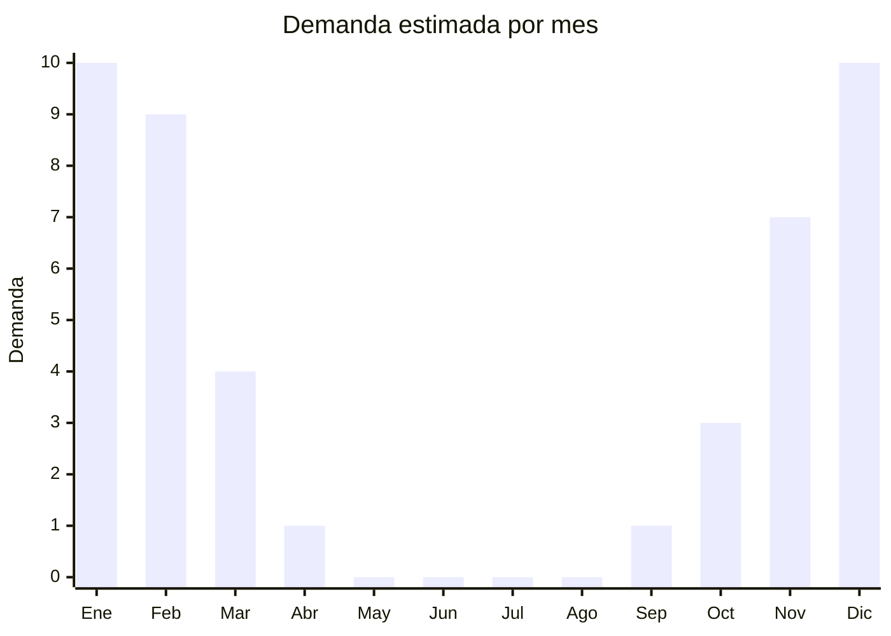

# Pelotas de playa inflables

> **Capítulo NCM 95** — Juguetes, juegos y artículos para recreo o deporte | **Temporada:** Verano (Dic–Feb)

## Qué es y por qué importarlo

Las pelotas de playa inflables son esferas de PVC fino con paneles de colores vibrantes, diseñadas para jugar en la playa, la pileta o el parque durante el verano. Son uno de los íconos más reconocibles del verano y probablemente el producto con mejor relación costo-margen del mercado estacional: el FOB puede ser tan bajo como USD 0.20 por unidad y se venden por miles.

China produce virtualmente el 100% de las pelotas de playa del mundo, con fábricas en Guangdong y Zhejiang especializadas en inflables de PVC. La ventaja logística es extraordinaria: desinfladas y dobladas, miles de pelotas caben en un solo cartón master. Un contenedor de 20 pies puede transportar decenas de miles de unidades.

El producto es ideal para importadores que buscan un artículo de bajo riesgo, alta rotación y margen generoso. También funciona como producto complementario dentro de un mix de artículos de verano o como artículo promocional para empresas (se pueden personalizar con logos a bajo costo).

## Datos clave

| Dato | Valor |
|------|-------|
| **Posiciones NCM típicas** | 9503.00.99 (juguetes varios — pelotas infantiles), 9506.62.00 (pelotas inflables — uso deportivo/recreativo) |
| **Derecho de importación** | 20% (DIE) + 3% tasa estadística |
| **Rango FOB típico** | USD 0.20 — USD 1.00 por unidad |
| **Precio de venta en Argentina** | ARS 2.000 — ARS 8.000 |
| **Margen bruto estimado** | 300% — 600% |
| **MOQ típico** | 1.000 — 10.000 unidades |
| **Demanda en MercadoLibre** | Alta (estacional) |
| **Competencia en MercadoLibre** | Media |
| **Dificultad para importar** | Muy Fácil |
| **Certificaciones necesarias** | IRAM 3583 si se comercializa como juguete infantil (menores de 14 años) |
| **Antidumping** | No |

## Variantes y subtipos más comunes

| Subtipo / Variante | FOB aprox. | Venta AR aprox. | Nota |
|--------------------|-----------|-----------------|------|
| Pelota clásica paneles 40cm | USD 0.20 — 0.40 | ARS 2.000 — 4.000 | Ícono del verano, mínimo costo |
| Pelota grande 50-60cm | USD 0.40 — 0.70 | ARS 3.500 — 6.000 | **Más vendida** |
| Pelota gigante 80-100cm | USD 0.70 — 1.00 | ARS 5.000 — 8.000 | Impacto visual, juegos grupales |
| Pelota con glitter/LED interior | USD 0.50 — 1.00 | ARS 4.000 — 8.000 | Novedad, mayor percepción de valor |
| Pelota personalizada con logo | USD 0.30 — 0.60 | ARS 3.000 — 5.000 | Uso promocional empresarial |

## Regulaciones y requisitos

<Tabs>
  <Tab title="Certificaciones">
    | Organismo | Requiere | Detalle |
    |-----------|----------|---------|
    | ARCA (Aduana) | Sí siempre | Despacho estándar |
    | IRAM 3583 | Condicional | **Obligatorio si se comercializa como juguete para menores de 14 años.** Si el packaging o publicidad lo posiciona para niños, aplica IRAM. |
    | ANMAT | No | No aplica |
    | ENACOM | No | No es electrónico |
    | SENASA | No | No aplica |

    <Warning>
    **IRAM 3583 es obligatorio** si la pelota de playa se comercializa como juguete infantil. Si el packaging muestra niños, indica rango de edad, o el producto se destina claramente a menores de 14 años, la certificación es requisito. Las pelotas decorativas o promocionales para adultos pueden estar exentas, pero ante la duda, certificar para evitar problemas en aduana.
    </Warning>
  </Tab>

  <Tab title="Etiquetado">
    | Requisito | Aplica |
    |-----------|--------|
    | Idioma español | Sí |
    | Datos del importador | Sí |
    | Composición / materiales | Sí (PVC) |
    | Dimensiones inflada | Recomendado |
    | País de origen | Sí |
    | Garantía legal 6 meses | Sí |
    | Rango de edad recomendado | Sí (si es juguete) |
    | Advertencias | Sí (no usar como salvavidas, supervisión adulta en agua) |
  </Tab>

  <Tab title="Restricciones">
    Sin restricciones especiales más allá de IRAM 3583 si aplica. No hay antidumping ni licencias previas.

    **Atención:** Las pelotas con LED interior que usan baterías tipo botón deben tener compartimento de batería asegurado con tornillo (requisito IRAM para juguetes). Las baterías botón representan riesgo de ingestión para menores.
  </Tab>
</Tabs>

## Logística

| Dato | Valor |
|------|-------|
| **Peso típico por unidad** | 0.03 — 0.10 kg |
| **Volumen típico** | Ínfimo desinfladas (excelente ratio unidades/CBM) |
| **Fragilidad** | Muy Baja |
| **Envío recomendado** | Marítimo LCL (consolidado con otros productos) |
| **Tiempo total estimado** | 50 — 80 días (marítimo) |
| **Baterías de litio** | No (excepto modelos con LED) |
| **Requiere empaque especial** | No |

<Tip>
Las pelotas desinfladas pesan gramos y ocupan milímetros de espesor. Son el **producto ideal para rellenar espacios vacíos** en un contenedor con otros artículos de verano. 5.000 pelotas desinfladas pueden caber en 2-3 cartones master. Usarlas como producto complementario en un pedido de piletas o flotadores optimiza el flete sin costo adicional significativo.
</Tip>

## Estacionalidad



| Aspecto | Detalle |
|---------|---------|
| **Meses pico** | Diciembre-Febrero (verano, playa, pileta) |
| **Meses valle** | Mayo-Septiembre (sin demanda) |
| **Cuándo pedir** | Julio-Agosto para tener stock en noviembre |

## Ventajas y riesgos

<CardGroup cols={2}>
  <Card title="Ventajas" icon="circle-check">
    - Costo FOB ridículamente bajo (desde USD 0.20)
    - Desinfladas no ocupan espacio: miles por cartón
    - Margen porcentual altísimo (300-600%)
    - Producto ícono del verano, demanda asegurada
    - Ideal como complemento/relleno en envíos mixtos
    - Personalizables con logo para uso promocional
  </Card>
  <Card title="Riesgos" icon="triangle-exclamation">
    - Ticket bajo por unidad: necesita volumen alto para facturación significativa
    - IRAM 3583 si se vende como juguete infantil
    - PVC muy fino puede pincharse fácil (verificar espesor mínimo 0.18mm)
    - Altamente estacional
    - Competencia de precio: difícil diferenciarse
  </Card>
</CardGroup>

## Palabras clave para buscar en Alibaba

```
inflatable beach ball wholesale, PVC beach ball bulk, beach ball custom logo,
inflatable beach ball 40cm 50cm, giant beach ball wholesale, beach ball glitter,
promotional beach ball custom, rainbow beach ball PVC
```

## Fuentes

- [MercadoLibre Argentina — Pelotas de playa inflables](https://listado.mercadolibre.com.ar/pelota-playa-inflable)
- [Alibaba — Inflatable beach ball wholesale](https://www.alibaba.com/showroom/inflatable-beach-ball.html)
- [IRAM — Norma 3583 Seguridad de juguetes](https://www.iram.org.ar)
