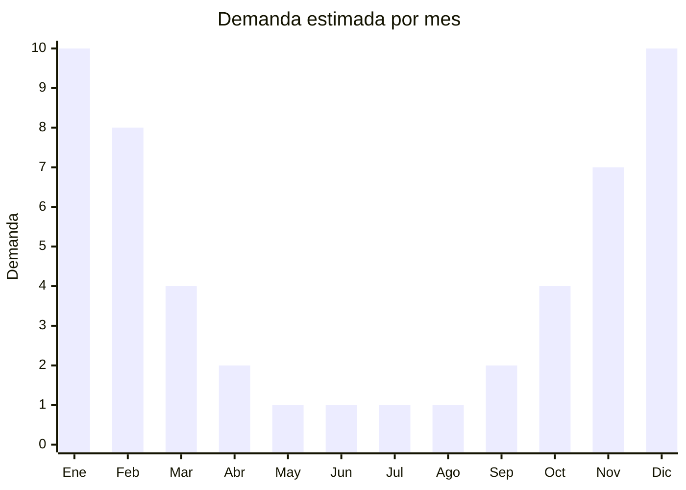

# Piletas inflables y estructurales

> **Capítulo NCM 95** — Juguetes, juegos y artículos para recreo o deporte | **Temporada:** Verano (Dic–Feb)

## Qué es y por qué importarlo

Las piletas inflables y estructurales son piscinas portátiles diseñadas para uso doméstico, desde pequeños modelos infantiles de 1 metro de diámetro hasta grandes estructurales de 4-5 metros con estructura metálica. Son EL producto por excelencia del verano argentino: cuando el calor aprieta, millones de familias buscan una solución accesible para refrescarse en casa sin necesidad de ir a un club o balneario.

El mercado está dominado por dos gigantes chinos: Bestway (Shanghai) e Intex (Xiamen), que concentran la mayor parte de la producción mundial de piletas portátiles. Ambas tienen representación oficial en Argentina, pero también hay espacio para importar modelos genéricos de fábricas OEM de Zhejiang y Guangdong que fabrican piletas con especificaciones similares a menor costo FOB.

La demanda es extremadamente estacional: entre noviembre y febrero se vende el 85% del volumen anual. El desafío principal es logístico: las piletas estructurales grandes ocupan un volumen considerable incluso empacadas, y las inflables grandes (3 metros o más) también requieren cajas voluminosas con bombas y accesorios. Planificar el envío con 4-5 meses de anticipación es fundamental para no perder la temporada.

## Datos clave

| Dato | Valor |
|------|-------|
| **Posiciones NCM típicas** | 9506.99.00 (artículos y material para cultura física, gimnasia o atletismo), 9503.00.99 (juguetes — piletas infantiles) |
| **Derecho de importación** | 20% (DIE) + 3% tasa estadística |
| **Rango FOB típico** | USD 5.00 — USD 80.00 por unidad (inflables USD 5-30, estructurales USD 20-80) |
| **Precio de venta en Argentina** | ARS 15.000 — ARS 200.000+ |
| **Margen bruto estimado** | 100% — 250% |
| **MOQ típico** | 100 — 500 unidades (inflables), 50 — 200 (estructurales) |
| **Demanda en MercadoLibre** | Extremadamente Alta (estacional) |
| **Competencia en MercadoLibre** | Alta (Bestway e Intex dominan) |
| **Dificultad para importar** | Media-Alta (volumen, estacionalidad, certificaciones infantiles) |
| **Certificaciones necesarias** | IRAM 3583 obligatorio para piletas infantiles (menores de 14 años) |
| **Antidumping** | No |

## Variantes y subtipos más comunes

| Subtipo / Variante | FOB aprox. | Venta AR aprox. | Nota |
|--------------------|-----------|-----------------|------|
| Pileta inflable infantil 1-1.5m | USD 5.00 — 10.00 | ARS 15.000 — 30.000 | Requiere IRAM 3583 |
| Pileta inflable familiar 2-2.5m | USD 10.00 — 20.00 | ARS 30.000 — 60.000 | **Más vendida** |
| Pileta inflable grande 3m+ | USD 20.00 — 30.00 | ARS 60.000 — 100.000 | Alto volumen empacada |
| Pileta estructural 3m (redonda) | USD 20.00 — 40.00 | ARS 80.000 — 130.000 | Estructura metálica + liner PVC |
| Pileta estructural 4-5m (rectangular) | USD 40.00 — 80.00 | ARS 130.000 — 200.000+ | Requiere bomba filtrante |
| Pileta infantil con tobogán/juego | USD 15.00 — 25.00 | ARS 40.000 — 70.000 | Requiere IRAM 3583 |

## Regulaciones y requisitos

<Tabs>
  <Tab title="Certificaciones">
    | Organismo | Requiere | Detalle |
    |-----------|----------|---------|
    | ARCA (Aduana) | Sí siempre | Despacho estándar |
    | IRAM 3583 | Sí para infantiles | **Obligatorio para piletas destinadas a menores de 14 años.** Certifica seguridad de juguetes. |
    | ANMAT | No | No aplica |
    | ENACOM | No | No es electrónico |
    | SENASA | No | No aplica |

    <Warning>
    **IRAM 3583 es obligatorio** para toda pileta comercializada como producto infantil o destinada a niños menores de 14 años. Esto incluye piletas inflables infantiles con diseños de personajes, piletas con tobogán/juego, y cualquier modelo cuyo packaging o publicidad muestre niños. El incumplimiento puede resultar en la retención de la mercadería en aduana y multas.
    </Warning>
  </Tab>

  <Tab title="Etiquetado">
    | Requisito | Aplica |
    |-----------|--------|
    | Idioma español | Sí |
    | Datos del importador | Sí |
    | Composición / materiales | Sí (tipo de PVC, espesor) |
    | Capacidad en litros | Sí |
    | Dimensiones | Sí |
    | País de origen | Sí |
    | Garantía legal 6 meses | Sí |
    | Instrucciones de armado | Sí |
    | Advertencia de supervisión adulta | Sí (infantiles) |
    | Rango de edad recomendado | Sí (infantiles) |
  </Tab>

  <Tab title="Restricciones">
    Las piletas infantiles clasificadas como juguetes requieren certificación IRAM 3583. Las piletas estructurales grandes para uso familiar/adulto no tienen esta exigencia pero deben cumplir con etiquetado obligatorio.

    **Atención:** Si la pileta incluye bomba eléctrica filtrante, esta puede requerir intervención de ENACOM según su tipo. Las bombas con enchufe tipo I (argentino) simplifican la venta. Verificar voltaje 220V.
  </Tab>
</Tabs>

## Logística

| Dato | Valor |
|------|-------|
| **Peso típico por unidad** | 2 — 25 kg (según tamaño y tipo) |
| **Volumen típico** | Alto a Muy Alto (especialmente estructurales) |
| **Fragilidad** | Baja (PVC resistente, estructura metálica en cajas) |
| **Envío recomendado** | Marítimo FCL para volumen, LCL solo para muestras |
| **Tiempo total estimado** | 50 — 80 días (marítimo) |
| **Baterías de litio** | No |
| **Requiere empaque especial** | No, pero verificar cajas reforzadas para estructurales |

<Tip>
Las piletas inflables desinfladas y dobladas ocupan una fracción de su volumen real. Negociar con el proveedor **empaque comprimido al vacío** puede reducir el CBM hasta un 50%. Para estructurales, pedir que los tubos metálicos vayan dentro de la caja del liner para optimizar espacio. Considerar un contenedor de 40' HC (High Cube) para aprovechar la altura extra.
</Tip>

## Estacionalidad



| Aspecto | Detalle |
|---------|---------|
| **Meses pico** | Diciembre-Febrero (verano, vacaciones, calor extremo) |
| **Meses valle** | Mayo-Agosto (invierno, sin demanda) |
| **Cuándo pedir** | Julio-Agosto para tener stock en noviembre (inicio temporada) |

## Ventajas y riesgos

<CardGroup cols={2}>
  <Card title="Ventajas" icon="circle-check">
    - Demanda explosiva y predecible en verano
    - Producto aspiracional accesible (todos quieren una pileta)
    - Inflables desinflados = volumen compacto para envío
    - Compra recurrente (PVC se deteriora, se pincha, se cambia por modelo más grande)
    - Alto ticket en estructurales = buenos márgenes absolutos
  </Card>
  <Card title="Riesgos" icon="triangle-exclamation">
    - Extremadamente estacional: stock sobrante queda 10 meses
    - Estructurales ocupan mucho volumen en contenedor
    - Competencia directa con Bestway e Intex (marcas muy posicionadas)
    - Calidad del PVC variable (verificar espesor y resistencia UV)
    - IRAM 3583 obligatorio para infantiles agrega costo y tiempo
    - Bombas filtrantes eléctricas pueden complicar despacho
  </Card>
</CardGroup>

## Palabras clave para buscar en Alibaba

```
inflatable swimming pool wholesale, above ground pool frame, PVC inflatable pool family,
kids inflatable pool playground, metal frame swimming pool, structural pool rectangular,
inflatable pool with slide children, swimming pool set pump filter wholesale
```

## Fuentes

- [MercadoLibre Argentina — Piletas inflables](https://listado.mercadolibre.com.ar/piletas-inflables)
- [MercadoLibre Argentina — Piletas estructurales](https://listado.mercadolibre.com.ar/piletas-estructurales)
- [Alibaba — Inflatable swimming pool wholesale](https://www.alibaba.com/showroom/inflatable-swimming-pool.html)
- [IRAM — Norma 3583 Seguridad de juguetes](https://www.iram.org.ar)
