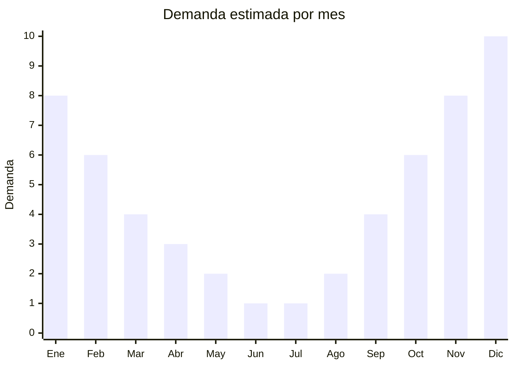

# Rollers y patines en línea

> **Capítulo NCM 95** — Juguetes, juegos y artículos para recreo o deporte | **Temporada:** Verano (Dic–Feb)

## Qué es y por qué importarlo

Los rollers (patines en línea o inline skates) son calzado con ruedas de poliuretano alineadas en una guía, diseñados para patinar sobre superficies lisas. Son un producto clásico de verano y actividades al aire libre: paseos en costaneras, parques, ciclovías y plazas. En Argentina, la demanda se concentra en primavera-verano y tiene un pico adicional en diciembre como regalo navideño para niños y adolescentes.

Los modelos extensibles (adjustable inline skates) son los más vendidos porque acompañan el crecimiento del pie del niño durante 3-4 talles. China produce la inmensa mayoría de rollers del mundo, con fábricas especializadas en Guangdong y Zhejiang que fabrican para marcas globales como Rollerblade, Fila, K2 y también para miles de marcas blancas. Los modelos genéricos chinos ofrecen prestaciones adecuadas para uso recreativo a una fracción del costo de marcas premium.

El producto tiene buena relación volumen-precio y una demanda predecible. El principal diferenciador es la calidad de las ruedas (PU), rodamientos (ABEC rating) y la bota (comodidad, sujeción del tobillo). Los modelos con luces LED en las ruedas son especialmente populares entre los niños.

## Datos clave

| Dato | Valor |
|------|-------|
| **Posiciones NCM típicas** | 9506.70.00 (patines de ruedas, incluidos los de bota) |
| **Derecho de importación** | 20% (DIE) + 3% tasa estadística |
| **Rango FOB típico** | USD 10.00 — USD 30.00 por par |
| **Precio de venta en Argentina** | ARS 30.000 — ARS 100.000 |
| **Margen bruto estimado** | 100% — 200% |
| **MOQ típico** | 100 — 500 pares |
| **Demanda en MercadoLibre** | Alta (estacional con pico verano + Navidad) |
| **Competencia en MercadoLibre** | Media |
| **Dificultad para importar** | Media (variedad de talles, calidad variable) |
| **Certificaciones necesarias** | IRAM 3583 para modelos infantiles (menores de 14 años). No aplica para modelos adultos. |
| **Antidumping** | No |

## Variantes y subtipos más comunes

| Subtipo / Variante | FOB aprox. | Venta AR aprox. | Nota |
|--------------------|-----------|-----------------|------|
| Roller extensible infantil básico | USD 10.00 — 15.00 | ARS 30.000 — 50.000 | **Más vendido**, 4 talles ajustables |
| Roller extensible infantil con LED | USD 12.00 — 18.00 | ARS 35.000 — 60.000 | Luces en ruedas, muy atractivo |
| Roller extensible + set protecciones | USD 15.00 — 22.00 | ARS 45.000 — 70.000 | Kit completo, regalo ideal |
| Roller adulto fitness/recreativo | USD 18.00 — 25.00 | ARS 55.000 — 80.000 | Bota semi-rígida, ABEC-7 |
| Roller adulto semi-profesional | USD 25.00 — 30.00 | ARS 75.000 — 100.000 | Bota rígida, mejor rodamiento |
| Patines 4 ruedas (quad) infantil | USD 10.00 — 18.00 | ARS 30.000 — 55.000 | Tendencia retro, niñas |

## Regulaciones y requisitos

<Tabs>
  <Tab title="Certificaciones">
    | Organismo | Requiere | Detalle |
    |-----------|----------|---------|
    | ARCA (Aduana) | Sí siempre | Despacho estándar |
    | IRAM 3583 | Condicional | **Obligatorio para modelos infantiles (menores de 14 años).** No aplica para modelos adultos. |
    | ANMAT | No | No aplica |
    | ENACOM | No | No es electrónico (LED en ruedas no requiere) |
    | SENASA | No | No aplica |

    <Warning>
    **IRAM 3583 es obligatorio** para rollers y patines comercializados como producto infantil o destinados a menores de 14 años. Esto incluye los modelos extensibles infantiles, que son la mayoría de las ventas. Los modelos para adultos (talle fijo, bota rígida) son equipamiento deportivo y no requieren IRAM. Si un mismo modelo se vende en talles infantiles y adultos, los talles infantiles requieren certificación.
    </Warning>
  </Tab>

  <Tab title="Etiquetado">
    | Requisito | Aplica |
    |-----------|--------|
    | Idioma español | Sí |
    | Datos del importador | Sí |
    | Composición / materiales | Sí (tipo de bota, ruedas, rodamientos) |
    | Talles disponibles | Sí |
    | Peso máximo de usuario | Recomendado |
    | País de origen | Sí |
    | Garantía legal 6 meses | Sí |
    | Advertencia uso de protecciones | Sí |
    | Rango de edad (si infantil) | Sí |
    | Sello IRAM (si infantil) | Sí |
  </Tab>

  <Tab title="Restricciones">
    Modelos infantiles requieren IRAM 3583. Modelos adultos no tienen restricciones especiales. No hay antidumping.

    **Atención:** Los rollers extensibles para niños son el producto de mayor venta y TODOS requieren IRAM 3583. Planificar la certificación como parte del costo de importación. Las ruedas con LED integrado no requieren ENACOM ya que funcionan por energía cinética (dinamo interno), no por baterías.
  </Tab>
</Tabs>

## Logística

| Dato | Valor |
|------|-------|
| **Peso típico por unidad** | 1.5 — 3.0 kg (par) |
| **Volumen típico** | Medio (caja individual por par) |
| **Fragilidad** | Baja (estructura resistente) |
| **Envío recomendado** | Marítimo LCL o FCL según volumen |
| **Tiempo total estimado** | 50 — 80 días (marítimo) |
| **Baterías de litio** | No (LED funcionan por dinamo) |
| **Requiere empaque especial** | No, caja individual estándar |

<Tip>
El mayor desafío de los rollers es la **gestión de talles**. Importar modelos extensibles (ej: 31-34, 35-38, 39-42) reduce la cantidad de SKUs necesarios ya que cada modelo cubre 4 talles. Pedir al proveedor una distribución de talles basada en la curva de demanda argentina (más stock en talles 33-38 que son los más pedidos). Incluir set de protecciones (rodilleras, coderas, muñequeras) en el mismo pedido para ofrecer kit completo.
</Tip>

## Estacionalidad



| Aspecto | Detalle |
|---------|---------|
| **Meses pico** | Octubre-Enero (primavera-verano + Navidad) |
| **Meses valle** | Junio-Agosto (invierno, menos uso outdoor) |
| **Cuándo pedir** | Julio-Agosto para tener stock en octubre |

## Ventajas y riesgos

<CardGroup cols={2}>
  <Card title="Ventajas" icon="circle-check">
    - Demanda predecible con doble pico (verano + Navidad)
    - Modelos extensibles cubren 4 talles = menos SKUs
    - Producto aspiracional accesible para niños
    - Venta cruzada con protecciones y accesorios
    - Rollers con LED muy atractivos para niños
    - Compra recurrente (niños crecen, cambian talle)
  </Card>
  <Card title="Riesgos" icon="triangle-exclamation">
    - IRAM 3583 obligatorio para modelos infantiles
    - Calidad de rodamientos variable (verificar ABEC rating real)
    - Ruedas de PU baja calidad se desgastan rápido
    - Sujeción de tobillo deficiente = quejas de seguridad
    - Gestión de inventario por talles requiere planificación
    - Competencia con marcas establecidas (Rollerblade, Fila)
  </Card>
</CardGroup>

## Palabras clave para buscar en Alibaba

```
inline skates wholesale, adjustable inline skates kids, roller skates children LED,
inline skates adult fitness, roller blades wholesale, quad roller skates,
inline skates adjustable light up wheels, protective gear set roller skates
```

## Fuentes

- [MercadoLibre Argentina — Rollers](https://listado.mercadolibre.com.ar/rollers)
- [MercadoLibre Argentina — Patines en línea](https://listado.mercadolibre.com.ar/patines-en-linea)
- [Alibaba — Inline skates wholesale](https://www.alibaba.com/showroom/inline-skates.html)
- [IRAM — Norma 3583 Seguridad de juguetes](https://www.iram.org.ar)
