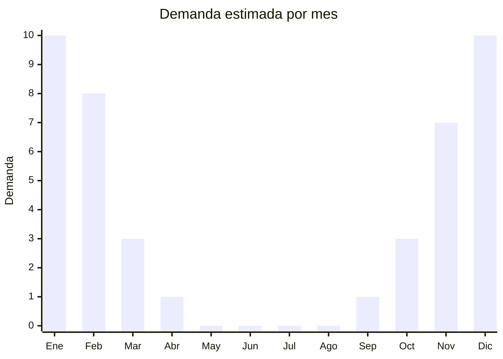

# Sets de playa infantiles

> **Capítulo NCM 95** — Juguetes, juegos y artículos para recreo o deporte | **Temporada:** Verano (Dic–Feb)

## Qué es y por qué importarlo

Los sets de playa infantiles son conjuntos de juguetes para arena que típicamente incluyen un baldecito (balde), pala, rastrillo, moldes de figuras y en algunos casos regadera o colador. Son el juguete clásico e imprescindible de todo verano: no hay familia con niños que vaya a la playa sin un set de estos.

China produce la totalidad de los sets de playa económicos del mercado mundial, con fábricas concentradas en Shantou y Yiwu. El costo FOB es extremadamente bajo (desde USD 0.50 por set básico), lo que permite márgenes generosos incluso con precios de venta accesibles. La clave está en la rotación: se venden en cantidades masivas durante diciembre-febrero, se pierden o rompen en la playa, y se recompran cada temporada.

Los sets vienen en infinidad de diseños, colores y personajes. Los modelos con licencias (Disney, Peppa Pig, etc.) tienen mayor precio pero también mayor riesgo legal si no cuentan con licencia autorizada. Los sets genéricos con diseños originales (animales marinos, castillos) son la opción más segura y rentable para importar.

## Datos clave

| Dato | Valor |
|------|-------|
| **Posiciones NCM típicas** | 9503.00.99 (juguetes varios) |
| **Derecho de importación** | 20% (DIE) + 3% tasa estadística |
| **Rango FOB típico** | USD 0.50 — USD 3.00 por set |
| **Precio de venta en Argentina** | ARS 4.000 — ARS 15.000 |
| **Margen bruto estimado** | 200% — 500% |
| **MOQ típico** | 500 — 3.000 sets |
| **Demanda en MercadoLibre** | Alta (estacional) |
| **Competencia en MercadoLibre** | Alta (muchos vendedores) |
| **Dificultad para importar** | Fácil |
| **Certificaciones necesarias** | IRAM 3583 obligatorio (juguete para menores de 14 años) |
| **Antidumping** | No |

## Variantes y subtipos más comunes

| Subtipo / Variante | FOB aprox. | Venta AR aprox. | Nota |
|--------------------|-----------|-----------------|------|
| Set básico 4 piezas (balde+pala+rastrillo+molde) | USD 0.50 — 1.00 | ARS 4.000 — 7.000 | Económico, alto volumen |
| Set completo 8-10 piezas | USD 1.00 — 2.00 | ARS 7.000 — 12.000 | **Más vendido** |
| Set premium con carretilla/camión | USD 2.00 — 3.00 | ARS 10.000 — 15.000 | Mayor percepción de valor |
| Set con mochila/bolsa red | USD 1.50 — 2.50 | ARS 8.000 — 13.000 | Práctico, fácil de transportar |
| Set con moldes de castillo grandes | USD 1.00 — 2.00 | ARS 6.000 — 10.000 | Muy popular |

## Regulaciones y requisitos

<Tabs>
  <Tab title="Certificaciones">
    | Organismo | Requiere | Detalle |
    |-----------|----------|---------|
    | ARCA (Aduana) | Sí siempre | Despacho estándar |
    | IRAM 3583 | Sí | **Obligatorio. Los sets de playa son juguetes destinados a menores de 14 años.** |
    | ANMAT | No | No aplica |
    | ENACOM | No | No es electrónico |
    | SENASA | No | No aplica |

    <Warning>
    **IRAM 3583 es obligatorio** para todos los sets de playa infantiles. Son juguetes destinados a niños menores de 14 años. El certificado debe obtenerse antes del despacho aduanero. Verificar especialmente que las piezas pequeñas (moldes) no representen riesgo de asfixia para menores de 3 años. Los materiales plásticos deben estar libres de ftalatos y metales pesados según los límites de la norma.
    </Warning>
  </Tab>

  <Tab title="Etiquetado">
    | Requisito | Aplica |
    |-----------|--------|
    | Idioma español | Sí |
    | Datos del importador | Sí |
    | Composición / materiales | Sí (tipo de plástico, libre de BPA) |
    | País de origen | Sí |
    | Garantía legal 6 meses | Sí |
    | Rango de edad recomendado | Sí (obligatorio) |
    | Advertencias de seguridad | Sí (piezas pequeñas menores de 3 años) |
    | Sello IRAM | Sí (visible en packaging) |
  </Tab>

  <Tab title="Restricciones">
    Requiere certificación IRAM 3583. No hay antidumping ni licencias previas adicionales.

    **Atención:** Los sets con personajes con licencia (Disney, Marvel, Peppa Pig) requieren autorización del titular de la licencia. Importar juguetes con marcas o personajes sin licencia puede resultar en retención aduanera por violación de propiedad intelectual. Usar diseños genéricos propios es la opción más segura.
  </Tab>
</Tabs>

## Logística

| Dato | Valor |
|------|-------|
| **Peso típico por unidad** | 0.15 — 0.50 kg |
| **Volumen típico** | Bajo-Medio (baldecitos apilables) |
| **Fragilidad** | Muy Baja (plástico flexible) |
| **Envío recomendado** | Marítimo LCL o consolidado con otros juguetes |
| **Tiempo total estimado** | 50 — 80 días (marítimo) |
| **Baterías de litio** | No |
| **Requiere empaque especial** | No |

<Tip>
Los baldecitos se **apilan perfectamente** unos dentro de otros, optimizando espacio. Pedir al proveedor que empaque los sets con los componentes dentro del balde y los baldes anidados. Un cartón master puede contener 20-40 sets. Combinar con otros juguetes de playa (pistolas de agua, pelotas) en el mismo envío para maximizar el aprovechamiento del contenedor.
</Tip>

## Estacionalidad



| Aspecto | Detalle |
|---------|---------|
| **Meses pico** | Diciembre-Febrero (verano, vacaciones, playa) |
| **Meses valle** | Abril-Septiembre (demanda nula) |
| **Cuándo pedir** | Julio-Agosto para tener stock en noviembre |

## Ventajas y riesgos

<CardGroup cols={2}>
  <Card title="Ventajas" icon="circle-check">
    - Costo FOB ínfimo, márgenes excepcionales
    - Demanda masiva y predecible cada verano
    - Se pierde/rompe = recompra asegurada cada temporada
    - Livianos, apilables, flete económico
    - No requiere servicio post-venta
  </Card>
  <Card title="Riesgos" icon="triangle-exclamation">
    - Altísima competencia (producto commodity)
    - IRAM 3583 obligatorio agrega costo fijo al despacho
    - Ticket bajo por unidad, necesita alto volumen para ser rentable
    - 100% estacional: stock sobrante queda hasta próximo verano
    - Riesgo de retención si hay personajes sin licencia
  </Card>
</CardGroup>

## Palabras clave para buscar en Alibaba

```
beach toy set children wholesale, sand toy bucket set, kids beach bucket shovel rake,
sand castle mold set, beach toy bag set kids, plastic sand toy wholesale,
summer beach toy set children, sand play set bulk
```

## Fuentes

- [MercadoLibre Argentina — Sets de playa infantiles](https://listado.mercadolibre.com.ar/set-playa-infantil)
- [Alibaba — Beach toy set wholesale](https://www.alibaba.com/showroom/beach-toy-set.html)
- [IRAM — Norma 3583 Seguridad de juguetes](https://www.iram.org.ar)
