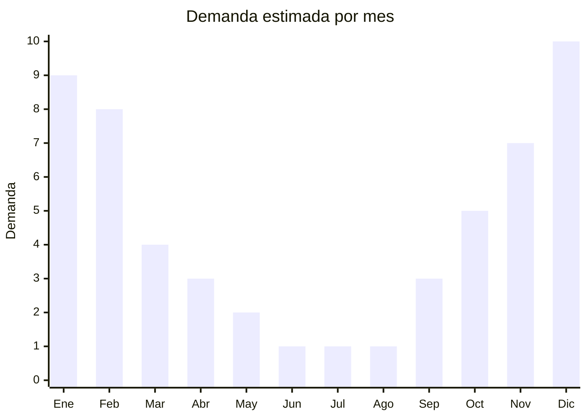

# Abanicos y abanicos plegables decorativos

> **Capítulo NCM 96** — Manufacturas diversas | **Temporada:** Verano (Dic–Feb)

## Qué es y por qué importarlo

Los abanicos plegables son accesorios de ventilación manual compuestos por varillas (generalmente de bambú o madera) y una superficie desplegable (tela, seda, papel o encaje) que genera brisa al agitarse. Además de su función práctica para combatir el calor, son productos decorativos, de moda y de cotillón/eventos (casamientos de verano, fiestas al aire libre, quince años, souvenirs).

En Argentina, la demanda de abanicos se concentra en los meses de verano (diciembre a febrero) por el calor intenso, y tiene un segundo pico por eventos sociales que se celebran en temporada cálida. China (especialmente Yiwu y Hangzhou) es el productor mundial por excelencia de abanicos, con siglos de tradición artesanal ahora industrializada. El FOB es extremadamente bajo (USD 0.30-2.00), el producto pesa gramos, ocupa mínimo espacio y ofrece márgenes de 400-800%.

El negocio destaca por su simplicidad: sin barreras regulatorias, sin componentes electrónicos, sin riesgos de rotura, sin vencimiento. Es un producto ideal para importadores principiantes que quieren testear el mercado con inversión mínima y riesgo casi nulo. También funciona como producto de venta cruzada y complemento de otros artículos de verano o eventos.

## Datos clave

| Dato | Valor |
|------|-------|
| **Posiciones NCM típicas** | 9619.00.90 (abanicos y pantallas de mano), 4602.19.00 (artículos de cestería de bambú - alternativa) |
| **Derecho de importación** | 18% (DIE) + 3% tasa estadística |
| **Rango FOB típico** | USD 0.30 — USD 2.00 por unidad |
| **Precio de venta en Argentina** | ARS 3.000 — ARS 15.000 |
| **Margen bruto estimado** | 400% — 800% |
| **MOQ típico** | 500 — 5000 unidades |
| **Demanda en MercadoLibre** | Media (estacional + eventos) |
| **Competencia en MercadoLibre** | Baja-Media |
| **Dificultad para importar** | Muy fácil |
| **Certificaciones necesarias** | No requiere certificaciones |
| **Antidumping** | No |

## Variantes y subtipos más comunes

| Subtipo / Variante | FOB aprox. | Venta AR aprox. | Nota |
|--------------------|-----------|-----------------|------|
| Abanico bambú + papel (liso) | USD 0.30 — 0.50 | ARS 3.000 — 5.000 | Cotillón, souvenir, básico |
| Abanico bambú + tela (estampado) | USD 0.50 — 0.80 | ARS 4.000 — 7.000 | **Más vendido** |
| Abanico bambú + seda (decorativo) | USD 0.80 — 1.50 | ARS 6.000 — 10.000 | Regalo, decoración |
| Abanico encaje blanco (eventos) | USD 1.00 — 2.00 | ARS 7.000 — 15.000 | Casamientos, quince años |
| Abanico bambú personalizable (logo) | USD 0.40 — 0.70 | ARS 4.000 — 6.000 | Merchandising, empresas |

## Regulaciones y requisitos

<Tabs>
  <Tab title="Certificaciones">
    | Organismo | Requiere | Detalle |
    |-----------|----------|---------|
    | ARCA (Aduana) | Sí siempre | Despacho estándar |
    | ANMAT | No | No aplica |
    | ENACOM | No | No es electrónico |
    | SENASA | No | No aplica |

    **Recomendación:** Producto sin barreras regulatorias. Si se importan abanicos con tintes o pinturas, verificar que los tintes sean no tóxicos (especialmente si se venden para niños como cotillón). Solicitar al proveedor certificado de materiales no tóxicos si los abanicos tienen colores intensos.
  </Tab>

  <Tab title="Etiquetado">
    | Requisito | Aplica |
    |-----------|--------|
    | Idioma español | Sí |
    | Datos del importador | Sí |
    | Composición / materiales | Sí (bambú, tela/seda/papel) |
    | País de origen | Sí |
    | Garantía legal 6 meses | Sí |
  </Tab>

  <Tab title="Restricciones">
    Sin restricciones de importación. No hay antidumping, licencias previas ni intervenciones de organismo alguno.

    **Nota:** Los abanicos de bambú y madera pueden requerir declaración fitosanitaria si SENASA considera que la madera no fue tratada. En la práctica, el bambú procesado y lacado no genera observaciones, pero consultar con despachante si el lote es grande.
  </Tab>
</Tabs>

## Logística

| Dato | Valor |
|------|-------|
| **Peso típico por unidad** | 0.020 — 0.080 kg |
| **Volumen típico** | Muy bajo (plegados ocupan mínimo espacio) |
| **Fragilidad** | Baja-Media (varillas de bambú pueden quebrarse si se comprimen) |
| **Envío recomendado** | Marítimo LCL consolidado, o courier si lote pequeño |
| **Tiempo total estimado** | 45 — 75 días (marítimo), 10-15 días (courier) |
| **Baterías de litio** | No |
| **Requiere empaque especial** | No (cajas estándar con separadores) |

<Tip>
Los abanicos son uno de los productos con **mejor ratio valor/peso** para importar. Un cartón de 200 abanicos pesa menos de 10 kg y ocupa menos de 0.05 CBM. Incluso pueden enviarse por courier internacional (DHL, FedEx) manteniendo un costo de flete por unidad inferior a USD 0.10. Son ideales para importaciones iniciales de testeo o para completar contenedores con espacio libre.
</Tip>

## Estacionalidad



| Aspecto | Detalle |
|---------|---------|
| **Meses pico** | Noviembre-Febrero (calor + eventos de verano) |
| **Meses valle** | Junio-Agosto (sin calor, pocos eventos al aire libre) |
| **Cuándo pedir** | Agosto-Septiembre para tener stock en noviembre (inicio temporada) |

## Ventajas y riesgos

<CardGroup cols={2}>
  <Card title="Ventajas" icon="circle-check">
    - FOB insignificante, margen excepcional (400-800%)
    - Producto ultraliviano, flete casi gratuito
    - Cero barreras regulatorias
    - Doble mercado: verano + eventos/cotillón
    - Ideal para personalización y marca propia
  </Card>
  <Card title="Riesgos" icon="triangle-exclamation">
    - Producto percibido como muy barato (ticket bajo)
    - Demanda principal concentrada en verano
    - Varillas de bambú pueden quebrarse si la calidad es baja
    - Competencia de bazares y todo por dos pesos
    - Stock no vendido ocupa poco espacio pero pierde vigencia estética
  </Card>
</CardGroup>

## Palabras clave para buscar en Alibaba

```
folding fan bamboo wholesale, hand fan bamboo fabric,
folding fan wedding favor, silk hand fan bulk,
bamboo fan custom print, lace hand fan white wedding,
paper folding fan wholesale, Chinese hand fan decoration
```

## Fuentes

- [MercadoLibre Argentina — Abanicos plegables](https://listado.mercadolibre.com.ar/abanico-plegable)
- [Alibaba — Folding fan bamboo wholesale](https://www.alibaba.com/showroom/folding-fan-bamboo.html)
