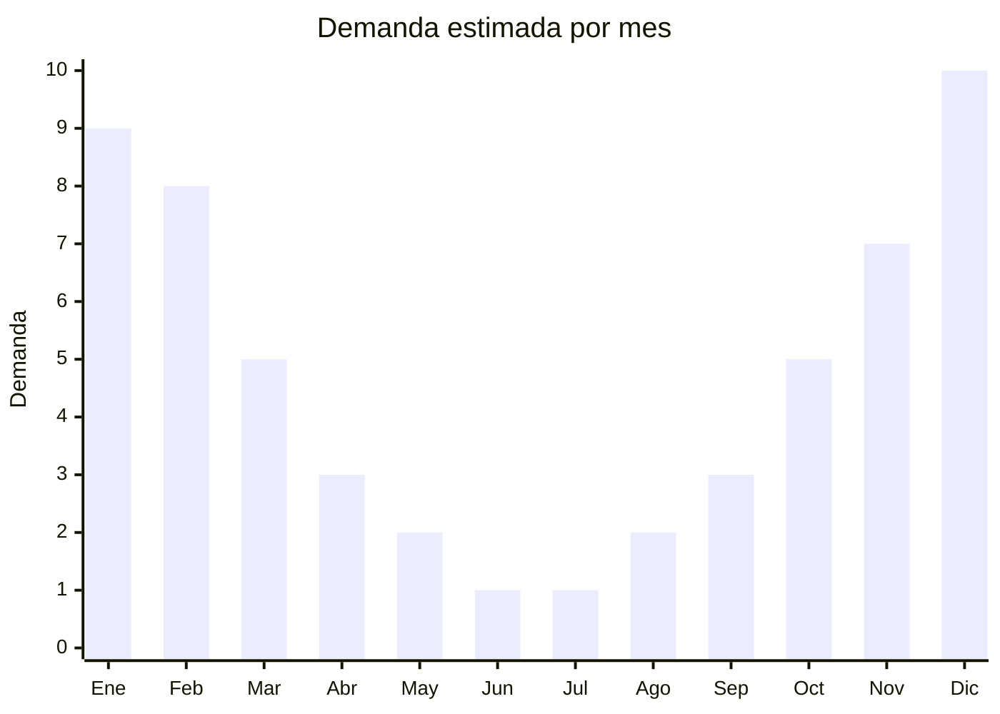

# Protectores labiales con SPF

> **Capítulo NCM 96** — Manufacturas diversas | **Temporada:** Verano (Dic–Feb)

## Qué es y por qué importarlo

Los protectores labiales con SPF (lip balm con factor de protección solar) son productos cosméticos en formato barra o tubo que protegen los labios de la radiación ultravioleta, la deshidratación y las quemaduras solares. Combinan ceras (de abeja, carnauba), aceites hidratantes y filtros solares (SPF 15, 30 o 50). En Argentina, la exposición solar intensa del verano (diciembre a febrero) dispara la demanda de protección labial, especialmente en contextos de playa, pileta, deportes al aire libre y actividades en la nieve.

China produce protectores labiales white label (marca blanca) a escala masiva, con FOB desde USD 0.20 por unidad, permitiendo a importadores crear su propia marca con inversión mínima. Las fábricas en Guangzhou y Yiwu ofrecen formulaciones con SPF, sabores, colores y packaging personalizado desde MOQ accesibles. Las marcas de referencia en Argentina son Blistex, Neutrogena y La Roche-Posay (premium), pero el segmento económico está dominado por marcas genéricas.

El negocio es atractivo por el margen bruto altísimo y el peso/volumen insignificante. Sin embargo, la principal barrera es regulatoria: si el producto se comercializa como cosmético con protección solar (SPF), requiere registro ante ANMAT (Disposición 7667), similar a los protectores solares del Capítulo 33.

## Datos clave

| Dato | Valor |
|------|-------|
| **Posiciones NCM típicas** | 9616.10.00 (pulverizadores de tocador y sus monturas y cabezas), 3304.99.90 (preparaciones de belleza para labios - alternativa Cap. 33) |
| **Derecho de importación** | 18% (DIE) + 3% tasa estadística |
| **Rango FOB típico** | USD 0.20 — USD 1.00 por unidad |
| **Precio de venta en Argentina** | ARS 3.000 — ARS 12.000 |
| **Margen bruto estimado** | 300% — 600% |
| **MOQ típico** | 1000 — 5000 unidades |
| **Demanda en MercadoLibre** | Media-Alta (estacional) |
| **Competencia en MercadoLibre** | Media |
| **Dificultad para importar** | Alta (requiere ANMAT si tiene SPF) |
| **Certificaciones necesarias** | ANMAT (Disp. 7667 si se comercializa con SPF) |
| **Antidumping** | No |

## Variantes y subtipos más comunes

| Subtipo / Variante | FOB aprox. | Venta AR aprox. | Nota |
|--------------------|-----------|-----------------|------|
| Lip balm básico hidratante (sin SPF) | USD 0.20 — 0.30 | ARS 3.000 — 5.000 | Sin barrera ANMAT |
| Lip balm SPF 15 barra | USD 0.30 — 0.50 | ARS 4.000 — 7.000 | Protección básica |
| Lip balm SPF 30 barra | USD 0.40 — 0.60 | ARS 5.000 — 8.000 | **Más vendido** |
| Lip balm SPF 50 premium | USD 0.60 — 1.00 | ARS 7.000 — 12.000 | Protección máxima |
| Lip balm tinted SPF (con color) | USD 0.50 — 0.80 | ARS 6.000 — 10.000 | Cosmético + protección |

## Regulaciones y requisitos

<Tabs>
  <Tab title="Certificaciones">
    | Organismo | Requiere | Detalle |
    |-----------|----------|---------|
    | ARCA (Aduana) | Sí siempre | Despacho estándar |
    | ANMAT | Sí (con SPF) | Disposición 7667 — Registro como cosmético con protección solar |
    | ENACOM | No | No es electrónico |
    | SENASA | No | No aplica |

    **Recomendación:** El registro ANMAT para cosméticos con SPF es un proceso que puede demorar 3-6 meses y requiere análisis de laboratorio de la formulación, estudios de estabilidad y evidencia del factor de protección declarado. Una alternativa para evitar ANMAT es importar protectores labiales **sin SPF** (solo hidratantes) que clasifican como cosmético de baja complejidad con trámite simplificado. Si se decide ir con SPF, asociarse con un laboratorio local para el registro.
  </Tab>

  <Tab title="Etiquetado">
    | Requisito | Aplica |
    |-----------|--------|
    | Idioma español | Sí |
    | Datos del importador | Sí |
    | Ingredientes INCI completo | Sí (obligatorio ANMAT) |
    | Factor SPF declarado | Sí (si aplica) |
    | Fecha de vencimiento | Sí |
    | Lote de producción | Sí |
    | País de origen | Sí |
    | Número de registro ANMAT | Sí (si tiene SPF) |
    | Contenido neto (gramos) | Sí |
  </Tab>

  <Tab title="Restricciones">
    No hay antidumping para protectores labiales.

    **Atención:** La barrera regulatoria de ANMAT es significativa y similar a la del Capítulo 33 (protectores solares corporales). Si el producto declara un factor SPF en el envase, ANMAT lo clasifica como cosmético con acción protectora solar y requiere registro completo. Comercializar un producto con SPF sin registro ANMAT es una infracción grave. Evaluar cuidadosamente si el margen justifica el costo y tiempo de registro, o si es más conveniente importar versiones solo hidratantes (sin SPF).
  </Tab>
</Tabs>

## Logística

| Dato | Valor |
|------|-------|
| **Peso típico por unidad** | 0.010 — 0.025 kg |
| **Volumen típico** | Muy bajo (producto diminuto) |
| **Fragilidad** | Baja (empaque sólido, barra compacta) |
| **Envío recomendado** | Marítimo LCL consolidado, o aéreo por peso mínimo |
| **Tiempo total estimado** | 50 — 80 días (marítimo), 12-20 días (aéreo) |
| **Baterías de litio** | No |
| **Requiere empaque especial** | Sí (control de temperatura, evitar exposición a calor >40C) |

<Tip>
Los protectores labiales son sensibles al calor: las ceras pueden derretirse durante el transporte en contenedor (temperatura interior hasta 60C en verano). Solicitar al proveedor **empaque con protección térmica** (film reflectivo o aislante) y preferir envíos en meses fríos del hemisferio sur (julio-septiembre). Si el envío es marítimo en verano, considerar contenedor reefer o asegurar que el contenedor no quede al sol en puerto.
</Tip>

## Estacionalidad



| Aspecto | Detalle |
|---------|---------|
| **Meses pico** | Noviembre-Febrero (exposición solar intensa, playa) |
| **Meses valle** | Junio-Agosto (baja exposición solar) |
| **Cuándo pedir** | Julio-Agosto para tener stock en noviembre (considerar tiempo ANMAT) |

## Ventajas y riesgos

<CardGroup cols={2}>
  <Card title="Ventajas" icon="circle-check">
    - FOB bajísimo, margen brutal (300-600%)
    - Producto diminuto: flete prácticamente gratuito
    - Ideal para marca propia (white label fácil)
    - Compra impulsiva, consumo recurrente
    - Variedad de sabores/colores para diferenciarse
  </Card>
  <Card title="Riesgos" icon="triangle-exclamation">
    - ANMAT obligatorio si tiene SPF (costo y tiempo)
    - Sensible al calor durante transporte
    - Competencia con marcas farmacéuticas posicionadas
    - Fecha de vencimiento (producto perecedero, 12-24 meses)
    - Formulación debe ser verificada (alérgenos)
  </Card>
</CardGroup>

## Palabras clave para buscar en Alibaba

```
lip balm SPF wholesale, lip balm sunscreen private label,
lip balm SPF 30 OEM, lip balm stick wholesale custom logo,
sun protection lip balm bulk, lip balm SPF 50 manufacturer,
lip care sunscreen stick, chapstick SPF wholesale
```

## Fuentes

- [MercadoLibre Argentina — Protector labial SPF](https://listado.mercadolibre.com.ar/protector-labial-spf)
- [Alibaba — Lip balm SPF wholesale](https://www.alibaba.com/showroom/lip-balm-spf.html)
- [ANMAT — Disposición 7667 (cosméticos con protección solar)](https://www.argentina.gob.ar/anmat/cosmeticos)
